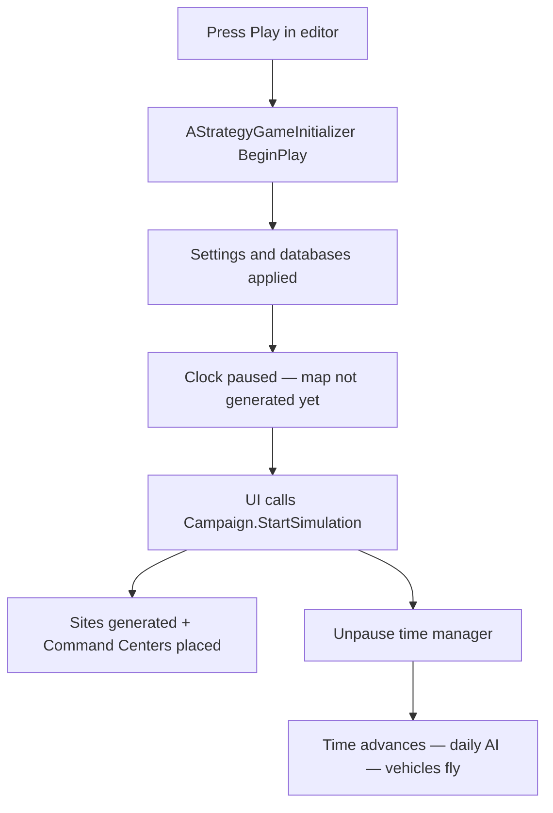
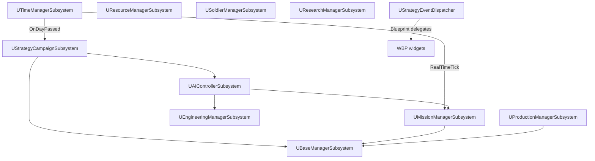

# Strategic Simulation Plugin

> Unreal Engine 5 strategic layer plugin (XCOM-style geoscape): bases, economy, research, live vehicle missions, and AI vs AI.

**Broken Gameplay Studios** · Runtime module · Requires **CommonUI**

**Design wiki:** [`docs/README.md`](docs/README.md) — linked PR plans (salvage PR-1–7, radar/intel PR-8–14)

| Audience | Section |
|----------|---------|
| **Designers / level setup** | [Part I — Designer Guide](#part-i--designer-guide) |
| **Developers / extenders** | [Part II — Developer Reference](#part-ii--developer-reference) |

---

## Part 0 — Overview & Current Status

### What it is

This plugin implements a turn-of-time strategic simulation layer: factions build bases and facilities, recruit soldiers, research technology, produce vehicles, and run live map missions. Vehicles move across a logical 2D map, use radar to discover sites and enemy contacts, and can engage in abstract vehicular combat. The daily loop is driven by AI for both Human and Enemy factions (configurable).

### What works today

- Dual-faction simulation with daily AI (build, recruit, research, equip, missions)
- Logical map (default 1920×1080) with generated sites and two starting Command Centers
- Live vehicle movement with range budgeting, phased pathing (outbound → on-station → return)
- Radar discovery of potential base sites and resource nodes
- AI vehicle production by **Vehicle Type** (Scout first, then Gunship/Heavy fighters)
- Staggered daily mission launches (one slot per idle vehicle per base, spread across 24h)
- Armed vehicular combat (Gunship/Heavy with equipped weapons and sufficient offensive rating)
- Offensive base-attack missions after a configurable start day (default: day 5)
- Base attack flow: fighter flies to enemy base, logs `[BASE ATTACK EVENT]` on launch and arrival
- Salvage sites created when vehicles are destroyed; combat participants know wreck location immediately (`KnownFactions`)
- Site-map save/load round-trip (`SaveCampaign` / `LoadCampaign`, schema v2) for QA — not a playable Continue Game
- Salvage missions (`EMissionType::Salvage`) — Transport/Support/Scout recover wreck resources hourly
- Debug strategic map HUD (bases, vehicles, paths, radar circles)
- Test harness (`AStrategyTestActor`) and `WBP_StrategicHUD` UI widgets

### In progress (PR-15+)

- **Radar & intel** — follow-on polish as needed ([`docs/design-radar-intel-patrol-summary.md`](docs/design-radar-intel-patrol-summary.md))
- PR-8 shipped: docs wiki hub, `bAllowDebugExecCommands`, `bRadarLOSEnabled`, `bStaleIntelEnabled` feature flags
- PR-9 shipped: `UFactionIntelSubsystem`, stale wreck tooltips, save schema v3 intel arrays
- PR-10 shipped: `URadarTerrainSubsystem`, LOS blocker zones, combat engagement fix (gunship `AttackPower`), defensive guard patrols
- PR-11 shipped: Command Center passive radar, `FRadarContact`, `LaunchInterceptionAtContact` (player + AI)
- PR-12 shipped: contact heading/threatened-base fields, expiry events + stale UI fade, universal `HandleVehicleDestroyed` wreck creation
- PR-13 shipped: fog-fair spoke recon (`UExplorationSubsystem`), path-sweep vehicle radar, enemy-base discovery, threat-bearing guard patrols
- PR-14 shipped: en-route inbound intercept (`bEngageInboundThreatsWhileInTransit`, `[INTERCEPT] En-route:`), mission-launch array fix, debug radar pastels

### What is not implemented yet

- Base attack **outcome** (no strategic damage to enemy bases — arrival is log-only)
- Tactical map load for player PvE fights
- POW recovery missions, gear-based combat resolution, faction-specific technology trees
- `Defensive` and `Interception` mission types (targeting logic exists; AI does not schedule them)
- Abstract mission day countdown (`SimulateOneDay`) — all new missions use live movement
- Research unlock gating (`HasCompletedResearch` is a stub)
- Soldier casualties on mission resolution (always zero)
- Ammo depletion (`MaxAmmo == 0` treated as infinite)

---

## Part I — Designer Guide

*For level designers and gameplay tuners. No C++ required.*

### 1.1 Prerequisites

- Host Unreal project with this plugin enabled
- **CommonUI** plugin enabled (hard dependency)
- Recommended test content:
  - `Content/StratTestGameMode.uasset`
  - `Content/UI/WBP_StrategicHUD.uasset`

### 1.2 Level setup checklist

```
[ ] Place AStrategyGameInitializer in the level
[ ] Assign all 6 database assets on the initializer (see 1.3)
[ ] Tune map and AI settings on the initializer (see 1.4)
[ ] Set starting resources for Human and Enemy factions
[ ] (Optional) Place AStrategyTestActor — auto-spawns WBP_StrategicHUD on play
[ ] (Optional) Set GameMode HUD class to AStrategyDebugHUD for map overlay
```

### 1.3 Wiring data assets

On **`AStrategyGameInitializer`** (Details panel), assign these soft references:

| Property | Typical asset | Contains |
|----------|---------------|----------|
| Item Database Asset | `Content/Data/DA_ItemDatabase` | Soldier gear |
| Facility Database Asset | `Content/Data/DA_FacilityDatabase` | All facility types |
| Soldier Class Database Asset | `Content/Data/DA_SoldierDatabase` | Soldier classes |
| Research Database Asset | `Content/Data/DA_ResearchDatabase` | Research projects |
| Vehicle Database Asset | `Content/Data/DA_VehicleDatabase` | Vehicle definitions |
| Vehicle Item Database Asset | `Content/Data/DA_Vehicle_Items` | Vehicle weapons and ammo |

Individual definition assets live under `Content/Data/DA/`:

| Folder | Examples |
|--------|----------|
| `Fac/` | Command Center, Hanger, Laboratory, Medical Bay, Vehicle Repair |
| `Veh/` | `DA_Veh_BRT-4` (recon), `DA_Veh_BT-8` (fighter) |
| `Sol/` | Commander, Grunt |
| `Item/` | M16, Basic Armor, grenades |
| `Res/` | Research project definitions |
| `Tech/` | Unlock tech definitions |

**Vehicle behavior is controlled by Vehicle Type on each `UVehicleDefinition`**, not by array order in the database:

| Vehicle Type | AI behavior |
|--------------|-------------|
| Scout, Transport, Support | Recon missions only |
| Gunship, Heavy | Armed, may run Offensive missions and engage in combat |

Open each vehicle asset in the editor and verify **Vehicle Type** is set correctly.

### 1.4 Tuning gameplay

All properties below are on **`AStrategyGameInitializer`** and are copied to `UStrategyCampaignSubsystem` at level start.

#### Map Generation

| Property | Default | What it does |
|----------|---------|--------------|
| Number Of Strategic Sites | 25 | Count of potential base/resource nodes (5–100) |
| Minimum Distance Between Sites | 350 | Minimum spacing between nodes |
| Logical Map Width | 1920 | Logical X coordinate space |
| Logical Map Height | 1080 | Logical Y coordinate space |
| Map Border Padding | 100 | Inset from map edges for playable area |
| Min Distance Between Factions | 700 | Minimum separation of Human and Enemy Command Centers |
| Max Faction Bases | 4 | Maximum bases per faction (expansion cap) |

#### AI Simulation

| Property | Default | What it does |
|----------|---------|--------------|
| Start With Human AI | true | Run daily AI for the Human faction |
| Start With Enemy AI | true | Run daily AI for the Enemy faction |
| Stagger Mission Launches | true | Spread vehicle departures evenly across the 24-hour game day |
| Offensive Missions Start Day | 5 | First day Gunship/Heavy may schedule base-attack missions |
| Min Offense To Engage | 10 | Minimum offensive rating (base + weapons) required to start combat |

#### Starting Resources

Set `HumanStartingStockpile` and `EnemyStartingStockpile` (Money, Metals, Biologicals, Chemicals, Exotic Material, Research Points).

#### Debug

| Property | Default | What it does |
|----------|---------|--------------|
| Verbose Logging | false | Extra subsystem logs |
| Show Unlock Messages | true | `[UNLOCK]` console messages |
| Show Facility Ticks | false | Per-facility tick logs (very noisy) |

### 1.5 Running the simulation



**Steps:**

1. **Play in editor.** The initializer runs automatically. Look for: *"Simulation INITIALIZED — Press Start to generate map and begin"*.
2. **Start the campaign.** From `WBP_StrategicHUD` or Blueprint, call `UStrategyCampaignSubsystem::StartSimulation()`. This generates the map and places both Command Centers.
3. **Unpause time.** `StartSimulation` sets time scale to 1.0 but does **not** clear the paused flag. Also call one of:
   - `UTimeManagerSubsystem::TogglePause()`
   - `UTimeManagerSubsystem::StartSimulation()`
   
   Without this step, the real-time tick loop will not advance and vehicles will not move.
4. **Control time** via `WBP_TimeControl` (if wired): pause, resume, adjust time scale.

**Manual AI trigger (testing):**

- Blueprint: `UStrategyCampaignSubsystem::Debug_RunAI()`
- Or: `UAIControllerSubsystem::Debug_RunAI()` (runs both factions if enabled)

### 1.6 Watching the simulation

#### Debug map HUD (`AStrategyDebugHUD`)

Set as the level GameMode HUD class, then use console commands:

| Command | Effect |
|---------|--------|
| `ToggleDebugHUD` | Toggle master debug visibility |
| `ToggleStrategyMap` | Toggle logical map overlay |
| `ShowSiteInfo 0` | Print info for site index 0 |
| `ClearSiteInfo` | Clear site inspector |

Editor properties on the HUD:

- `bShowVehiclePaths` — yellow outbound paths, orange return paths
- `bShowStrategyMap` — draw sites and bases on canvas
- Vehicles show cyan radar radius circles and phase/behavior labels

#### Output Log filters

All tags use `LogTemp`. Filter in the Output Log window:

| Filter | What you will see |
|--------|-------------------|
| `[AI]` / `[AI TICK]` | Daily AI: builds, vehicles, missions, expansion |
| `[MISSION]` | Mission queued or departed |
| `[MISSION TARGET]` | Recon or patrol target coordinates |
| `[LIVE MISSION]` | Movement activated, range checks, completion |
| `[BASE ATTACK EVENT]` | Fighter assigned to or arrived at enemy base |
| `[DETECT]` | Radar contact with enemy vehicle |
| `[COMBAT]` | Engagement started, damage, destruction |
| `[DISCOVERY]` | New site revealed by recon radar |
| `[SALVAGE]` | Wreck site created after combat loss |
| `[EXPANSION DEBUG]` | Preconditions for AI base expansion |
| `[CAMPAIGN]` | Day rollover and repair summary |
| `[MAP]` / `[BASE INIT]` | Map generation and starting base placement |

### 1.7 Designer workflow tips

- **Days 1–4 (default):** Only recon missions. Scouts discover undiscovered nodes on the map.
- **Day 5+:** Gunship/Heavy vehicles with an in-range enemy base schedule `Offensive` missions. Watch for `[MISSION] Scheduled ... Offensive`.
- **No combat?** Confirm the fighter log shows `[AI] equipped vehicle weapon` and that `Min Offense To Engage` is not set too high for your weapon stats.
- **Expansion:** AI builds a new base when every existing base owns a vehicle, faction Money > 9500, and a discovered unused site is available.
- **Pacing:** Lower `Offensive Missions Start Day` for earlier attacks. Increase `Number Of Strategic Sites` for more expansion options. Increase `Min Distance Between Factions` for a slower opening.
- **Vehicle range:** If missions are skipped, check `[LIVE MISSION] ... insufficient range` — targets may be beyond the vehicle's `MaxRange`.

---

## Part II — Developer Reference

*For engineers extending or integrating systems.*

### 2.1 Repository layout

```
StrategicSimulationPlugin/
├── StrategicSimulationPlugin.uplugin
├── README.md
├── Content/
│   ├── Data/                  # Aggregate database assets
│   │   └── DA/                # Individual definitions (Fac, Veh, Sol, Item, Res, Tech)
│   ├── UI/                    # WBP_StrategicHUD, time control, roster widgets
│   └── StratTestGameMode.uasset
├── Source/StrategicSimulationPlugin/
│   ├── Public/                # Subsystem and domain headers
│   ├── Private/               # Implementations
│   └── StrategicSimulationPlugin.Build.cs
└── Resources/
    └── Icon128.png
```

### 2.2 Architecture

All simulation state lives on **GameInstance subsystems** (access via `GetGameInstance()->GetSubsystem<T>()`).



| Subsystem | Header | Responsibility |
|-----------|--------|----------------|
| Campaign | `UStrategyCampaignSubsystem.h` | Start/stop/reset, save/load, settings, daily orchestration, DB accessors |
| Time | `UTimeManagerSubsystem.h` | Game calendar, pause/scale, `OnDayPassed`, real-time tick |
| Base | `UBaseManagerSubsystem.h` | Site generation, bases, facilities, power, repairs, expansion, salvage |
| Mission | `UMissionManagerSubsystem.h` | Mission launch/scheduling, live movement, combat outcomes |
| AI | `UAIControllerSubsystem.h` | Per-faction daily decisions (`RunAIForFaction`) |
| Resource | `UResourceManagerSubsystem.h` | Faction stockpiles, affordability, income |
| Soldier | `USoldierManagerSubsystem.h` | Roster, recruit, training, POW |
| Research | `UResearchManagerSubsystem.h` | Active projects, tech progression |
| Engineering | `UEngineeringManagerSubsystem.h` | Item purchase, vehicle weapons, workshop production |
| Production | `UProductionManagerSubsystem.h` | Job completion (soldier, vehicle, facility, research) |
| Events | `UStrategyEventDispatcher.h` | UI-facing multicast delegates |

**Domain objects (UObjects):**

| Class | Role |
|-------|------|
| `UStrategyBase` | Faction base instance |
| `UStrategyFacility` | Built facility; hangars hold parked vehicles |
| `UStrategyVehicle` | Vehicle instance; live movement, radar, combat |
| `UStrategySoldier` | Soldier instance |
| `UMissionGroup` | Active mission group |
| `UStrategySiteDefinition` | Map site (potential base, resource, salvage) |

**Level actors:**

| Actor | File | Role |
|-------|------|------|
| `AStrategyGameInitializer` | `AStrategyGameInitializer.cpp` | `BeginPlay`: loads DBs, copies settings to campaign |
| `AStrategyDebugHUD` | `AStrategyDebugHUD.cpp` | Canvas overlay for map, bases, vehicles, paths |
| `AStrategyTestActor` | `StrategyTestActor.cpp` | Spawns `WBP_StrategicHUD`, binds event dispatcher |

**Shared types:** `Source/StrategicSimulationPlugin/Public/StrategicSimulationTypes.h`

Key enums: `EFactionType`, `EMissionType`, `EVehicleType`, `EVehicleBehavior`, `EVehicleMissionPhase`, `EStrategySiteType`, `FResourceStockpile`

### 2.3 Simulation lifecycle

| Step | What happens |
|------|--------------|
| 1. Module init | `UStrategyCampaignSubsystem::Initialize` binds `OnDayPassed` to campaign and mission manager |
| 2. Level load | `AStrategyGameInitializer::BeginPlay` copies DB refs and settings; time manager starts **paused** at 2026-01-01 |
| 3. Start | `UStrategyCampaignSubsystem::StartSimulation` → `GenerateInitialSites`, `InitializeStartingBases`, `SetTimeScale(1)` |
| 4. Tick | `UTimeManagerSubsystem::RealTimeTick` advances calendar, calls `UMissionManagerSubsystem::UpdateAllLiveVehicles` |
| 5. Day rollover | `OnDayPassed` broadcast on calendar day change |
| 6. Daily sim | Campaign: repairs; AI: `RunAIForFaction` for each enabled faction |
| 7. Stop | `StopSimulation` sets time scale to 0; `ResetSimulation` clears state |

**Duplicate AI guard:** `UAIControllerSubsystem::LastProcessedDayPerFaction` prevents running the same faction twice on the same calendar day (both AI and Campaign subsystems bind `OnDayPassed`).

### 2.4 Mission system

#### Mission types (`EMissionType`)

| Type | AI schedules? | Target selection |
|------|---------------|------------------|
| Recon | Yes (scouts, fallback) | Nearest undiscovered `PotentialBase` / `ResourceNode` in range; patrol if none |
| Offensive | Yes (fighters, day ≥ N) | Random in-range enemy base |
| Defensive | No | In-range enemy base (same as Offensive branch) |
| Interception | No | Nearest enemy vehicle in flight, else enemy base |

#### Scheduling flow

```
RunAIForFaction
  → GatherIdleVehiclesAtBase (per base with operational Hanger)
  → PickAIMissionTypeForVehicle (per vehicle)
  → ScheduleVehicleMissionsForBase (one mission per vehicle, optional 24h stagger)
  → StartMission (deferred or immediate)
  → ProcessPendingMissionLaunches (on RealTimeTick)
  → ActivateLiveMovementForVehicles
  → TryPickMissionTarget → BeginMissionMovement
```

**Idle vehicle criteria** (`GatherIdleVehiclesAtBase`):

- Parked in operational Hanger
- No current mission, not destroyed
- `CurrentRangeLeft > 0`, not needing repair
- Health ≥ 95% of max

#### Vehicle movement phases (`EVehicleMissionPhase`)

```
Docked → EnRoute → OnStation → EnRoute (return) → Docked
              ↓                      ↑
           Combat ←→ Returning ───────┘
```

- **Recon** launches with `Scouting` behavior; **Offensive** with `Attacking`
- Offensive **OnStation** triggers `HandleBaseAttackArrival` (log placeholder)
- Range: round-trip deducted at launch; `PlannedRoundTripRange` and `RangeTraveledThisMission` enforced during flight and combat

#### Mission resolution

When all vehicles in a fleet are docked or destroyed, `ResolveMissionOutcome` runs:

- Recon: 200–500 research points
- Other types: money/metals by outcome tier
- `OnMissionCompleted` delegate broadcast

### 2.5 AI daily loop (`RunAIForFaction`)

Order of operations per faction per day:

1. Advance facility construction
2. Apply facility income
3. Facility build wave (all bases): Command → Barracks → Lab → Workshop → Hanger → Medical → Repair → Containment/Autopsy
4. Vehicle production (`SelectVehicleDefinitionToBuild` by `EVehicleType`)
5. Per-base mission prep: equip weapons on Gunship/Heavy, refill ammo, schedule missions
6. Recruit soldiers (barracks-cap aware)
7. Start research (if Laboratory free)
8. Buy and equip soldier gear
9. Workshop production
10. Expansion check (all bases have vehicles, Money > 9500, discovered site available)

**Vehicle build priority** (`SelectVehicleDefinitionToBuild`):

1. If faction has no Scout/Transport/Support → build affordable scout-type
2. Else if combat count < scout count → build affordable Gunship/Heavy
3. Fallback: any affordable type in DB

### 2.6 Combat and detection

```
PerformRadarPing (every PingIntervalHours, default 0.5 game hours)
  → site discovery (undiscovered nodes within radar range)
  → TryDetectVehicle (enemy parked + in-flight vehicles)
    → HandleVehicleDetected → UAIControllerSubsystem::HandleVehicleDetection
      → ShouldEngageVehicle?
        → SetBehavior(Attacking) → EVehicleMissionPhase::Combat
          → ProcessCombatTick (offensiveRating × 0.35 × deltaHours damage)
            → HandleVehicleDestroyed → CreateSalvageSite
```

**Engagement requirements** (`ShouldEngageVehicle`):

- Different factions
- At least one equipped weapon
- `GetVehicleOffensiveRating() >= MinOffenseToEngage` (campaign setting, default 10)

**Combat end conditions:** target destroyed, combat timeout (2h one-sided / 6h mutual), range budget exceeded, or too far from planned outbound distance.

### 2.7 UI integration

**Base widget classes:**

- `UStrategyUserWidget` — extends `UCommonUserWidget`
- `UStrategyActivatableWidget` — extends `UCommonActivatableWidget`

**Event dispatcher** (`UStrategyEventDispatcher`) — Blueprint-assignable delegates:

- `OnSoldierRecruited`, `OnResearchCompleted`, `OnVehicleCompleted`, `OnFacilityCompleted`, `OnProductionCompleted`, and others

**Content widgets** (`Content/UI/`):

- `WBP_StrategicHUD` — main HUD (spawned by `AStrategyTestActor`)
- `WBP_TimeControl` — pause/speed
- `WBP_ResourcePanel`, `WBP_RosterScreen` — resource and soldier displays

### 2.8 Extension hooks

| Goal | Primary files to change |
|------|-------------------------|
| New mission type | `StrategicSimulationTypes.h`, `UMissionManagerSubsystem.cpp`, `UAIControllerSubsystem.cpp`, `UStrategyVehicle.cpp` |
| Base attack resolution | `UMissionManagerSubsystem::HandleBaseAttackArrival` |
| AI build priority | `UAIControllerSubsystem::SelectVehicleDefinitionToBuild` |
| Engagement rules | `UAIControllerSubsystem::ShouldEngageVehicle` |
| Mission rewards / casualties | `UMissionManagerSubsystem::ResolveMissionOutcome` |
| Research gating | `UStrategyCampaignSubsystem::HasCompletedResearch` |
| Player tactical fights | Branch in mission resolver when attacker faction is Human player |
| New facility behavior | `UStrategyFacility.cpp`, `UFacilityDefinition.h` |
| UI reactions | Subscribe to `UStrategyEventDispatcher` delegates in Widget Blueprints |

### 2.9 Known technical debt

| Issue | Location / notes |
|-------|------------------|
| `StartSimulation` does not unpause time manager | `UStrategyCampaignSubsystem.cpp` — `bIsPaused` starts `true` |
| Duplicate `OnDayPassed` bindings | Both `UAIControllerSubsystem` and `UStrategyCampaignSubsystem` call AI; guarded by day-per-faction map |
| Day rollover uses calendar day-of-month | `UTimeManagerSubsystem::RealTimeTick` uses `FDateTime::GetDay()`, not elapsed simulation days |
| Abstract `SimulateOneDay` path unused | All `StartMission` calls set `bIsLiveMovement = true` |
| `CalculateFleetEffectiveness` unused | Defined in mission manager; not called in live resolution |
| Salvage AI prioritization / balance | PR-7 in `docs/design-salvage-sites.md` |
| `HasCompletedResearch` stub | Always returns `true` in campaign subsystem |
| `SoldiersKilled` always 0 | `ResolveMissionOutcome` — no abstract casualties |
| Ammo infinite when `MaxAmmo == 0` | `UItemDefinition` stub |
| `Defensive` / `Interception` not scheduled by AI | Targeting exists in `TryPickMissionTarget` only |
| Base attack is log-only | `HandleBaseAttackArrival` — placeholder for future resolver |

### 2.10 Site-map save/load (PR-4 — QA / dev tooling)

`SaveCampaign` / `LoadCampaign` round-trip **sites only** (generated nodes + salvage wrecks). This is **not** a playable Continue Game — bases, vehicles, missions, and soldiers are not restored.

| Setting | Location | Default |
|---------|----------|---------|
| `bSitesPersistenceEnabled` | `UStrategyCampaignSubsystem` | `true` — when `false`, save skips `SavedSites` (dev fast-save) |
| `StrategySiteMapSaveSchemaVersion` | `UStrategySaveGame.h` | `2` — older slots abort load with `[SAVE]` error |

**Recommended workflow**

1. **Playable session** → `StartSimulation()` (generates map + Command Centers).
2. **Verify site persistence** → play → `SaveCampaign` → `LoadCampaign` → inspect debug strategy map (`SiteId`, discovery dots, wreck resources).
3. **New game** → `ResetSimulation()` then `StartSimulation()`, or fresh PIE session.

**Post-`LoadCampaign` state**

| Restored | Not restored |
|----------|----------------|
| `AllPotentialSites`, discovery lists, per-site resources / salvage metadata, `SiteId` | Bases, facilities, vehicles, active missions |
| Faction resource pools, simulation day | AI scheduling (no hangars) |

After load, `GetBases(Human).Num() == 0` — log warns: *Simulation NOT runnable — no bases.* Do **not** call `StartSimulation()` after `LoadCampaign` in the same session (that regenerates the map). Same-session play → save → load clears stale missions via `ClearRuntimeMissionStateForSiteMapLoad`.

### 2.11 Player salvage map (PR-5)

`UStrategySalvageMapWidget` draws fog-aware wreck triangles on the player HUD. `AStrategyTestActor` spawns it above `WBP_StrategicHUD` (z-order 10).

| Gate | Requirement |
|------|-------------|
| Layer visible | `bSalvageSitesEnabled && bSitesPersistenceEnabled` on campaign subsystem |
| Wreck shown | `ShouldShowSalvageToFaction` (discovered / combat-known, `SalvageState == Active`) |
| Icon color | `GetSalvageWreckColor(WreckOwnerFaction)` — blue Human, red Enemy |
| Tooltip | `FormatSalvageTooltipText` — site name + last-known resources; appends `Intel stale` when snapshot is outdated |
| Toast | `OnSiteDiscovered` / combat-known wreck creation |

Blueprint helpers: `BuildSalvageMapMarkers`, `GetVisibleSalvageSitesForFaction`, `IsPlayerSalvageMapLayerEnabled`. To embed in a custom HUD, add `UStrategySalvageMapWidget` as a full-screen child or call the helpers from `WBP_StrategicHUD`.

### 2.12 Salvage missions (PR-6)

`EMissionType::Salvage` sends Transport / Support / Scout vehicles to known active wrecks. Gunship and Heavy cannot salvage (`IsSalvageCapableVehicleType`).

| Setting | Default |
|---------|---------|
| `bSalvageMissionsEnabled` | `true` — set `false` to block new salvage scheduling |
| `SalvageOnStationHours` | `4.0` — on-station extraction window |
| `SalvageEfficiencyMultiplier` | `4.0` — hourly extraction rate scale (~medium wreck in one 4h on-station window) |

Flow: schedule → fly to wreck → hourly `ProcessSalvageExtractionTick` → faction resources increase / wreck decreases → depletion calls `RemoveSalvageSite`. Resources are credited during extraction ticks (not again at mission resolve).

### 2.13 AI salvage prioritization (PR-7)

AI sends Transport / Support / Scout vehicles to high-value known wrecks. Enemy wrecks score higher (`+500` resource bonus in heuristic). Tune on `AStrategyGameInitializer` (copied to campaign at play).

| Setting | Default | Role |
|---------|---------|------|
| `MaxActiveSalvageMissionsPerFaction` | `2` | Caps concurrent salvage fleets |
| `MinSalvageScoreThreshold` | `15.0` | `(Metals + Chemicals + enemy bonus) / distance` gate |
| `SalvageDeclineAfterWinChance` | `0.35` | Combat winner may skip salvage (retaliation risk) |
| `LoserSalvageScoreMultiplier` | `1.5` | Stricter threshold for own-wreck recovery |
| `LoserSalvageMaxDistance` | `700` | Far + low-score own wrecks abandoned |

Daily trace: `[SALVAGE AI] Day N … opportunity` per known wreck. On schedule: `[SALVAGE AI] … scheduling salvage to site {id} score=…`.

### 2.14 Contested salvage (PR-6b)

When Human and Enemy both have active `Salvage` missions at the same `SiteId`, the mission manager fires `OnSalvageContestStarted`, pauses the strategic clock (`PauseStrategicClock`), and waits for the tactical layer to call `ResolveSalvageContest(Outcome)`.

| Outcome | Effect |
|---------|--------|
| `FactionAWins` (Human) | Enemy mission aborted, Human continues extraction |
| `FactionBWins` (Enemy) | Human mission aborted, Enemy continues |
| `FactionAAborts` / `FactionBAborts` | Withdrawing faction returns home; wreck unchanged |
| `MutualRetreat` | Both factions return; wreck unchanged |

Payload: `FSalvageContestForceSnapshot` per faction (vehicles, soldiers, origin base). Clock resumes after `ResolveSalvageContest`.

### 2.15 Radar & intel foundation (PR-8)

Feature flags on `AStrategyGameInitializer` (copied to campaign). Full plan: [`docs/design-radar-intel-patrol.md`](docs/design-radar-intel-patrol.md).

| Setting | Default (initializer) | Role |
|---------|----------------------|------|
| `bAllowDebugExecCommands` | `true` | Enables debug HUD Exec (`ToggleStrategyMap`, `ShowSiteInfo`, …) |
| `bRadarLOSEnabled` | `true` | Master toggle for terrain LOS (wired PR-10) |
| `bStaleIntelEnabled` | `true` | Master toggle for stale site intel (wired PR-9) |

Campaign defaults `bAllowDebugExecCommands` to `false` until initializer runs. Shipping builds should leave it off unless cheats are intended.

### 2.16 Stale site intel (PR-9)

`UFactionIntelSubsystem` stores per-faction `FSiteIntelSnapshot` (location, last-known resources, base-built flag, freshness). Observations come from radar pings, on-station refresh, and discovery (`UBaseManagerSubsystem::AddDiscoveredSite`). Fresh flags clear at end of each mission movement tick; intel becomes stale until the next observation.

| API | Role |
|-----|------|
| `ObserveSite` | Capture ground-truth snapshot for a faction |
| `GetDisplayResources` / `GetDisplayHasBase` | UI reads last-known values when `bStaleIntelEnabled` |
| `IsIntelFresh` | True only during the step when site was re-observed |
| `SerializeIntel` / `DeserializeIntel` | Save schema v3 (`SavedIntelHuman` / `SavedIntelEnemy`) |

v2 saves seed intel from discovery lists on load. Toggle off via `bStaleIntelEnabled` to restore ground-truth UI.

### 2.17 Radar LOS (PR-10)

`URadarTerrainSubsystem` stores `FRadarBlockerZone` shapes (circle / rect) from `AStrategyGameInitializer::RadarBlockerZones`. When `bRadarLOSEnabled`, site discovery and vehicle detection require `HasRadarLineOfSight` between ping origin and target. Blocked pings log `[RADAR LOS]` at verbose level; debug HUD draws zones in gray.

Vehicular combat: gunships engage when `GetVehicleOffensiveRating() >= MinOffenseToEngage` (intrinsic `AttackPower` counts). Offensive / interception missions log `[COMBAT] En-route intercept:` when strike fleets meet. `Defensive` missions patrol near their origin base instead of targeting enemy bases.

### 2.18 Base passive radar (PR-11)

Operational Command Centers ping on `BaseRadarPingIntervalHours` within `BaseRadarRangePixels` (no vehicle sortie). Sites inside range with LOS are discovered / intel-refreshed. In-transit enemy vehicles become `FRadarContact` entries (position, velocity estimate, inbound flag).

| API | Role |
|-----|------|
| `URadarContactSubsystem::GetContactsForFaction` | UI lists threats near your bases |
| `UMissionManagerSubsystem::LaunchInterceptionAtContact` | Explicit base + vehicle dispatch (same mission path as AI) |
| `UMissionManagerSubsystem::TryLaunchInterceptionAtContactAuto` | Player click path — nearest idle gunship |
| `UMissionManagerSubsystem::CanFactionInterceptContact` | Enable/disable intercept UI affordance |
| `OnRadarContactUpdated` | Widget toast when a new track appears |

AI: inbound contacts trigger immediate `[INTERCEPT AI]` if a combat vehicle is idle; daily scheduling prefers `Interception` when contacts exist.

**Player map overlay:** `UStrategyRadarContactMapWidget` draws contact diamonds on the HUD (orange = inbound + interceptable, cyan = track only). Hover for tooltip; **left-click** calls `TryLaunchInterceptionAtContactAuto`. `AStrategyTestActor` spawns it at z-order 11 (above salvage layer). Gated on `bBasePassiveRadarEnabled`.

Blueprint helpers: `BuildRadarContactMapMarkers`, `FormatRadarContactTooltipText`, `IsPlayerRadarContactLayerEnabled`.

### 2.19 Contact registry polish (PR-12)

| Item | Behavior |
|------|----------|
| `EstimatedHeadingDegrees` / `ThreatenedBaseName` | Stored on `FRadarContact`; shown in map tooltip |
| `OnRadarContactExpired` | Fires when `RadarContactExpiryHours` elapses without refresh |
| Stale UI | Marker alpha fades as contact ages (`GetRadarContactStalenessAlpha`) |
| Universal wreck | `HandleVehicleDestroyed` — any destroy path (combat or future crash) creates salvage when `bSalvageSitesEnabled` |

### 2.20 Build dependencies

`Source/StrategicSimulationPlugin/StrategicSimulationPlugin.Build.cs`:

- **Public:** `Core`, `CoreUObject`, `Engine`, `UMG`, `CommonUI`, `CommonInput`

Plugin dependency in `.uplugin`: **CommonUI** (must be enabled in host project).

---

## Quick reference — key Blueprint calls

| Action | Call |
|--------|------|
| Start campaign / generate map | `UStrategyCampaignSubsystem::StartSimulation` |
| Unpause simulation | `UTimeManagerSubsystem::TogglePause` or `StartSimulation` |
| Stop simulation | `UStrategyCampaignSubsystem::StopSimulation` |
| Reset all state | `UStrategyCampaignSubsystem::ResetSimulation` |
| Save / load site map (QA) | `SaveCampaign` / `LoadCampaign` (schema >= 2; intel arrays at schema 3) |
| New playable game | `StartSimulation` |
| Force AI tick | `Debug_RunAI` on Campaign or AI subsystem |
| Resolve contested salvage | `UStrategyCampaignSubsystem::ResolveSalvageContest` (after `OnSalvageContestStarted`) |
| Intercept radar contact (player) | `TryLaunchInterceptionAtContactAuto(Human, ContactId, …)` or click on `UStrategyRadarContactMapWidget` |
| Get managers | `GetResourceManager`, `GetBaseManager`, `GetMissionManager`, etc. on Campaign |

---

*Strategic Simulation Plugin v1.0 — Broken Gameplay Studios*