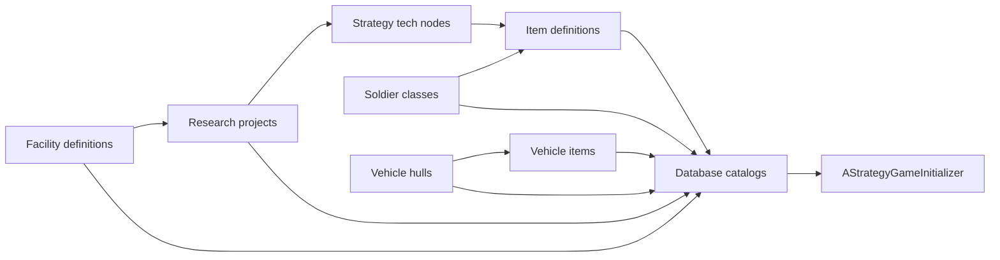

# Data assets

All gameplay content is authored as **Primary Data Assets** under `Content/Data/`. Six **database** assets register what the AI and systems may use; individual **definition** assets hold the stats.

## Databases (catalogs)

Assign these on **AStrategyGameInitializer** (copied to campaign on play):

| Initializer property | Typical asset | Contents |
|---------------------|---------------|----------|
| Item Database Asset | `DA_ItemDatabase` | Soldier gear, consumables |
| Vehicle Item Database Asset | `DA_Vehicle_Items` | Weapons, defense modules, ammo |
| Facility Database Asset | `DA_FacilityDatabase` | All buildable facilities |
| Soldier Class Database Asset | `DA_SoldierDatabase` | Trainable soldier classes |
| Research Database Asset | `DA_ResearchDatabase` | Laboratory projects (ordered list for AI) |
| Vehicle Database Asset | `DA_VehicleDatabase` | Hangar-buildable hulls |

Each database exposes a single **Catalog** array of soft references to definitions.

## Tech unlock chain

```
UResearchTechDefinition  →  UStrategyTechDefinition  →  UItemDefinition
                        ↘  UFacilityDefinition
                        ↘  UResearchTechDefinition (follow-on projects)
```

1. **Research project** — queued in a Laboratory; unlocks tech nodes, facilities, and/or more research
2. **Strategy tech** — item-tech tier within an `EItemCategory`; unlocks craftable items
3. **Item** — purchased or produced in a Workshop; equipped on soldiers or vehicles

Research unlock **gating is a stub** today (`HasCompletedResearch` always returns true). Wire your UI to facility/research completion events until per-faction tracking exists.

## Definition categories (editor layout)

Properties in the Details panel follow a consistent order. Use the same mental model when authoring.

### UItemDefinition

| Category | Fields |
|----------|--------|
| **Identity** | `ItemName`, `Category` |
| **Economy\|Cost** | `PurchaseCost` |
| **Economy\|Production** | `ProductionDays` |
| **Combat\|Soldier** | `Damage`, `ArmorBonus`, `AimBonus` (shown when category matches) |
| **Combat\|Vehicle** | `VehicleDamageBonus`, `VehicleDefenseBonus`, `MaxAmmo` |
| **Consumable** | `bIsConsumable`, `QuantityPerStack` |

`EItemCategory` drives which combat fields appear (`EditCondition` in editor).

### UFacilityDefinition

| Category | Fields |
|----------|--------|
| **Identity** | `FacilityName`, `FacilityType` |
| **Build\|Cost** | `BuildCost` |
| **Build\|Timing** | `BuildTimeDays` |
| **Build\|Limits** | `MaxBuilt` |
| **Build\|Requirements** | `PrerequisiteFacilities` |
| **Power** | `PowerProvided`, `PowerDraw` |
| **Production\|Queue** | `ProductionSlots`, `ProductionSpeedMultiplier`, `ProductionPerDay` |
| **Extraction** | `ExtractionPerDay` (from linked site stockpile) |
| **Service\|Repair** | `RepairHealthPerDay` (Vehicle Repair only) |
| **Capacity** | `Capacity` (soldiers in barracks, vehicles in hangar) |
| **Unlocks\|Research** | `UnlocksResearch` |

**ProductionSlots** = concurrent queue jobs (train, build, research, workshop, repair throughput).  
**Capacity** = stationed units the facility supports (Living Quarters / Hangar).

### USoldierClassDefinition

| Category | Fields |
|----------|--------|
| **Identity** | `ClassName` |
| **Stats** | `BaseStats` (Vitality / Combat / Mental / Mobility) |
| **Training\|Cost** | `TrainingCost` |
| **Training\|Timing** | `TrainingDays` |
| **Progression** | `StartingXP` |
| **Loadout\|Rules** | `AllowedItems`, `MaxLoadoutSize` |
| **Loadout\|Starting Gear** | `StartingGear` |

### UVehicleDefinition

| Category | Fields |
|----------|--------|
| **Identity** | `VehicleName`, `VehicleType`, `Description` |
| **Crew** | `SoldierCapacity` |
| **Combat** | `AttackPower` |
| **Range & Radar** | `MaxRange`, `RadarRangePixels` |
| **Durability** | `MaxHealth`, `DefaultDamageState` |
| **Hardpoints** | `MaxWeaponSlots`, `MaxDefenseSlots`, `AllowedWeaponCategories` |
| **Build\|Cost** | `BuildCost` |
| **Build\|Timing** | `ProductionDays` |
| **AI\|Behavior** | `DefaultBehavior` |

| VehicleType | Typical missions |
|-------------|------------------|
| Scout, Transport, Support | Recon, salvage |
| Gunship, Heavy | Combat, offensive, interception |

### UResearchTechDefinition

| Category | Fields |
|----------|--------|
| **Identity** | `ProjectName`, `Description` |
| **Economy\|Cost** | `ResearchCost` |
| **Economy\|Timing** | `ResearchDays` |
| **Unlocks\|Tech** | `UnlocksTech` → `UStrategyTechDefinition` |
| **Unlocks\|Facilities** | `UnlocksFacilities` |
| **Unlocks\|Research** | `UnlocksResearch` |

### UStrategyTechDefinition

| Category | Fields |
|----------|--------|
| **Identity** | `TechName`, `Description`, `Category`, `Tier` |
| **Unlocks\|Items** | `UnlocksItems` |

### FResourceStockpile (nested on costs)

| Category | Fields |
|----------|--------|
| **Economy\|Currency** | `Money` |
| **Economy\|Materials** | `Metals`, `Biologicals`, `Chemicals`, `ExoticMaterial` |
| **Economy\|Research** | `ResearchPoints` |

## Authoring workflow



1. Create **facilities** first (Command Center, Living Quarters, Laboratory, Workshop, Hangar, …) with prerequisites and build costs
2. Create **research projects** that unlock facilities and strategy tech
3. Create **strategy tech** nodes and link **items**
4. Create **soldier classes** with training cost/time and loadout rules
5. Create **vehicle hulls** and **vehicle items** (weapons/defense)
6. Add every asset to the matching **database Catalog** array
7. Assign databases on **AStrategyGameInitializer**

## Production at runtime

All production runs on **UStrategyFacility** queues — not a separate production subsystem.

| Job type | Facility | API |
|----------|----------|-----|
| Soldier training | Living Quarters | `StartProduction(Soldier, …)` |
| Vehicle build | Hangar | `StartProduction(Vehicle, …)` |
| Item fabrication | Workshop | `StartProduction(Item, …)` |
| Research | Laboratory | `UResearchManagerSubsystem::StartResearch` |
| Facility construction | Self | `StartConstruction` |

Daily advance: `AdvanceProductionDay` / `AdvanceConstructionDay` via base manager simulation.

Instant buy (no queue): `UEngineeringManagerSubsystem::PurchaseItem`, `PurchaseAndEquipVehicleWeapon`, `PurchaseAmmoForVehicle`.

## Sites (runtime, not in a database)

**UStrategySiteDefinition** instances are generated at runtime (map gen, wrecks). Authoring categories:

- **Identity** — `SiteName`, `SiteType`, `Location`
- **Resources\|Seed** — `MaxResources` (design-time / generation)
- **Runtime** / **Salvage\|Runtime** — simulation state (read-only in editor during play)

Discovery uses **`AddDiscoveredSite(Faction, Site, Reason)`** only — there is no location-based discovery overload.