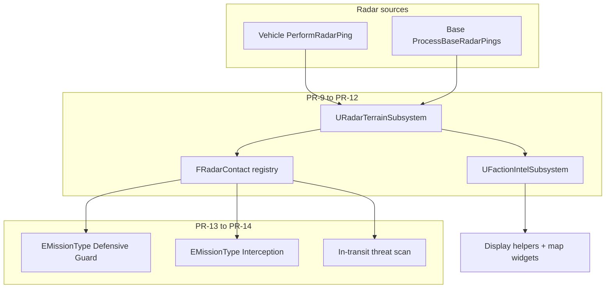

# Radar, Intel, Patrol & Interception — Design Document

| Field | Value |
|-------|-------|
| **Author** | Broken Gameplay Studios |
| **Status** | Approved for PR-8–14 |
| **Depends on** | Salvage sites PR-1–7 + PR-6b (shipped) |

**See also:** [Documentation wiki](./README.md) · [Summary](./design-radar-intel-patrol-summary.md) · [Salvage sites](./design-salvage-sites.md) · [Plugin README](../README.md)

---

## Problem

Today ([`UStrategyVehicle::PerformRadarPing`](../Source/StrategicSimulationPlugin/Private/UStrategyVehicle.cpp)):

- Radar uses **distance only** — no terrain blocking
- Discovery is **binary and permanent**; UI reads **last-known** resources when stale intel is on ([`FormatSalvageTooltipText`](../Source/StrategicSimulationPlugin/Private/UStrategicSimulationDisplayHelpers.cpp))
- Only **vehicles** ping; bases do not scan
- Enemy detections are **instant combat hooks** — no faction contact memory (position/heading)
- `EMissionType::Defensive` incorrectly shares **offensive base attack** targeting; AI never schedules Defensive/Interception ([README](../README.md))

---

## Goals

1. **Stale intel** — location persists; resources and base-built state refresh only on revisit
2. **Radar LOS** — mountain blocker zones (circular/rect) until pixel geography exists
3. **Base visibility** — passive Command Center radar discovers nearby sites
4. **Contact tracks** — record enemy ship last seen + estimated heading for patrol/intercept AI
5. **Patrol / Guard** — vehicles hold waypoints near threatened bases and engage in-range enemies
6. **En-route defense** — transit ships attack enemies inbound to friendly bases
7. **Docs wiki** — linked design docs under [`docs/`](./README.md)

---

## Architecture

---

## Feature flags (PR-8)

On [`UStrategyCampaignSubsystem`](../Source/StrategicSimulationPlugin/Public/UStrategyCampaignSubsystem.h), copied from [`AStrategyGameInitializer`](../Source/StrategicSimulationPlugin/Public/AStrategyGameInitializer.h):

| Flag | Default (initializer) | Purpose |
|------|-------------------------|---------|
| `bAllowDebugExecCommands` | `true` | Gates `AStrategyDebugHUD` Exec console commands |
| `bRadarLOSEnabled` | `true` | Master toggle for terrain LOS (wired PR-10) |
| `bStaleIntelEnabled` | `true` | Master toggle for intel snapshots (wired PR-9) |

Campaign subsystem defaults `bAllowDebugExecCommands` to **false** for shipping safety; initializer sets **true** in dev levels.

---

## Data model (upcoming PRs)

### FSiteIntelSnapshot (PR-9)

Per faction, per `SiteId`:

- `bLocationKnown` — never cleared after first sighting
- `LastKnownResources`, `bLastKnownHasBase` — stale until refresh
- `bHasFreshIntel` — true only while in radar/visit range
- `LastObservedGameHours`

### FRadarBlockerZone (PR-10)

Circular or axis-aligned rect zones on initializer; `URadarTerrainSubsystem::HasRadarLineOfSight(From, To)`.

### FRadarContact (PR-12)

Per detecting faction:

- `LastPosition`, `EstimatedVelocity`, `LastSeenGameHours`
- `InferredThreatenedBase` when inbound heuristic fires
- Expires if not refreshed

---

## Mission semantics (PR-13 / PR-14)

### Defensive → Guard (fix)

[`TryPickMissionTarget`](../Source/StrategicSimulationPlugin/Private/UMissionManagerSubsystem.cpp) today routes `Defensive` to enemy bases — **wrong**. New behavior:

- Threatened friendly base from contacts or enemy offensive missions
- Patrol waypoint along approach vector; long `GuardOnStationHours` on-station
- `Patrolling` behavior + active radar while holding

### Interception

- Schedule when `FRadarContact` exists and interceptor has range
- Target = contact position + velocity lead

### En-route engagement

- Any in-transit friendly vehicle scans for inbound enemy threats each movement tick
- `bEngageInboundThreatsWhileInTransit` on campaign (PR-14)

---

## Salvage & prior-gap integration

| Item | PR |
|------|-----|
| Stale wreck tooltips | PR-9 |
| Universal `HandleVehicleDestroyed` (all destroy paths) | PR-12 |
| `bAllowDebugExecCommands` Exec guard | **PR-8** |
| `ensure` on `CanBuildBaseOnSite(SalvageSite)` | **PR-8** |

---

## PR plan & Definition of Done

### PR-8: Docs wiki + foundation flags ✅ (this PR)

**Tasks:**
- [`docs/README.md`](./README.md) wiki hub
- This document + summary; cross-links from salvage docs
- Campaign flags + initializer propagation
- Exec guard on [`AStrategyDebugHUD`](../Source/StrategicSimulationPlugin/Private/AStrategyDebugHUD.cpp)
- `ensureMsgf` when `CanBuildBaseOnSite` called on salvage site

**Definition of Done:**
- [ ] `docs/README.md` links all design docs
- [ ] Salvage summary links forward to radar doc
- [ ] Root README links to docs hub
- [ ] `bAllowDebugExecCommands = false` on campaign blocks Exec; initializer `true` enables
- [ ] `bRadarLOSEnabled` / `bStaleIntelEnabled` on campaign + initializer
- [ ] Build succeeds

---

### PR-9: Faction intel snapshots ✅

**Definition of Done:**
- [x] `UFactionIntelSubsystem` stores per-faction `FSiteIntelSnapshot`
- [x] UI tooltips show stale marker + last-known resources
- [x] Save schema v3 includes intel arrays

---

### PR-10: Radar LOS + blocker zones ✅

**Definition of Done:**
- [x] Blocker zone between base and site prevents discovery
- [x] `[RADAR LOS]` verbose log on blocked ping
- [x] Debug HUD draws blocker zones

**Combat / guard fixes (same PR):**
- Gunships engage using `AttackPower` / offensive rating — equipped weapon items are no longer required
- `Defensive` missions patrol near origin base (no longer share `Offensive` enemy-base targeting)
- Offensive / interception crossings log `[COMBAT] En-route intercept:` when strike missions meet in transit

---

### PR-11: Base passive radar ✅

**Definition of Done:**
- [x] Command Center pings sites within `BaseRadarRangePixels` without vehicle sortie
- [x] Intel refreshed on base ping
- [x] `FRadarContact` tracks inbound enemy vehicles for player + AI
- [x] `LaunchInterceptionAtContact` — same attack-at-contact path for player UI and AI reactive/daily scheduling

---

### PR-12: Contact registry ✅

**Definition of Done:**
- [x] Contact stores position + heading + threatened base; expires when stale
- [x] `OnRadarContactUpdated` / `OnRadarContactExpired` fire on dispatcher
- [x] Universal `HandleVehicleDestroyed` creates salvage site on any destroy path

---

### PR-13: Patrol / Guard

**Definition of Done:**
- [ ] `Defensive` no longer targets enemy bases
- [ ] Threatened base schedules guard at patrol node
- [ ] `[PATROL AI]` log on schedule

---

### PR-14: Interception + en-route defense ✅

**Definition of Done:**
- [x] AI schedules `Interception` from contacts (PR-11)
- [x] In-transit combat vehicles engage inbound enemies (`bEngageInboundThreatsWhileInTransit`)
- [x] `[INTERCEPT] En-route:` log on inbound engagement
- [x] `ActiveMissions` no longer mutated during `ProcessPendingMissionLaunches` iteration

---

## Out of scope

- Pixel/zone geography authoring
- Tactical map / XCOM combat implementation
- Full campaign Continue Game save
- Dedicated Radar facility type (hook reserved; v1 uses Command range)

---

## References

| Resource | Path |
|----------|------|
| Vehicle radar | `Source/.../Private/UStrategyVehicle.cpp` |
| Site discovery | `Source/.../Private/UBaseManagerSubsystem.cpp` |
| Mission targeting | `Source/.../Private/UMissionManagerSubsystem.cpp` |
| AI combat | `Source/.../Private/UAIControllerSubsystem.cpp` |
| Salvage design | [`design-salvage-sites.md`](./design-salvage-sites.md) |