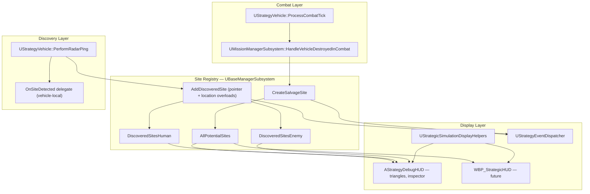
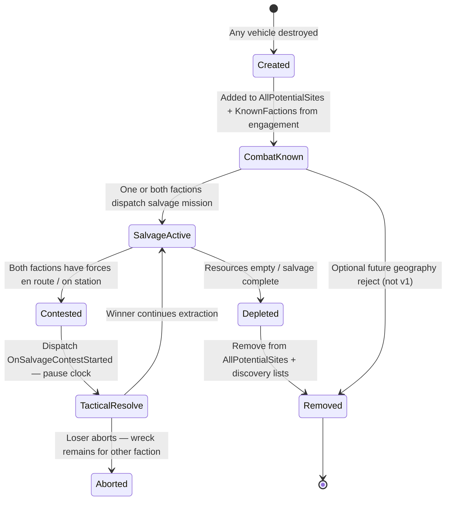
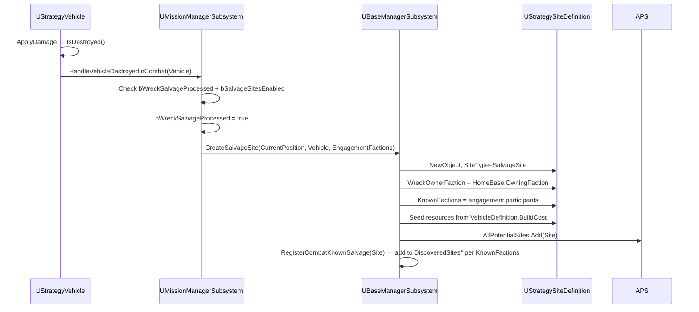
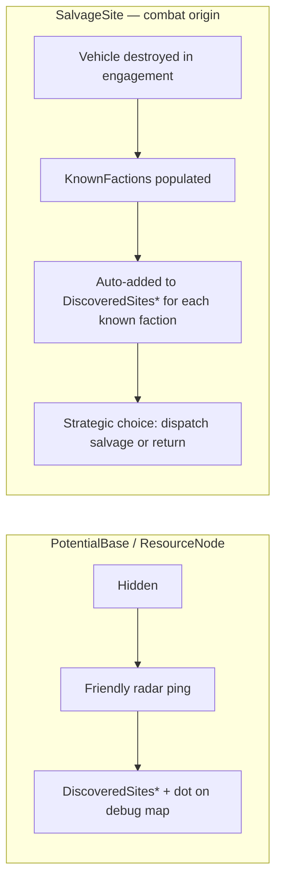
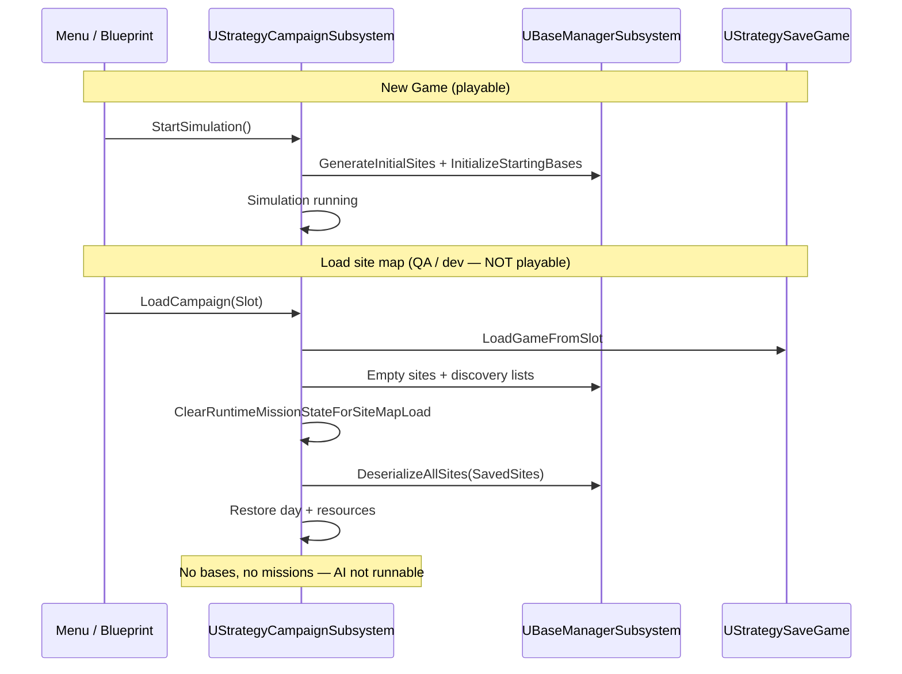
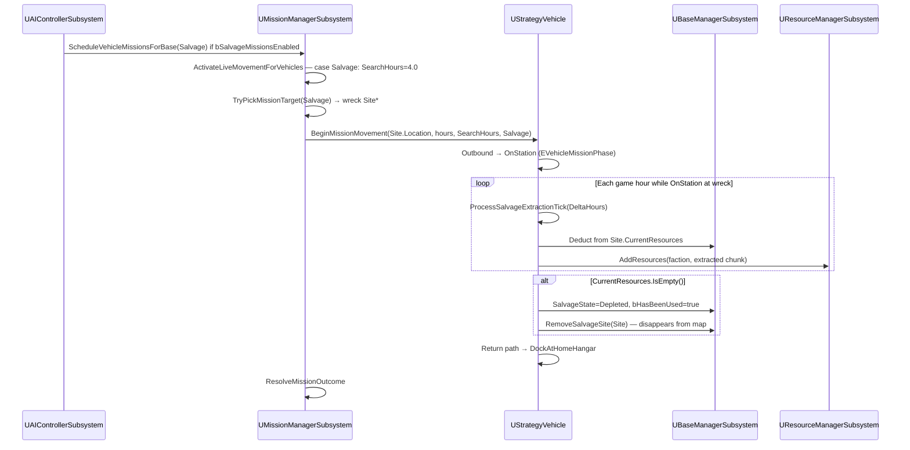

# Salvage Sites System — Design Document

> **Archive notice (June 2026):** PR-1–7 + 6b are **implemented**. For current behavior use the [user salvage guide](../salvage.md) and [implementation summary](./design-salvage-sites-summary.md). Superseded in source: `AddDiscoveredSiteAtLocation`, `TryBuildBaseOnSite`, `DiscoveringFaction` field. Discovery is `AddDiscoveredSite(Faction, Site, Reason)` only. New bases use vehicle-guarded expansion.

| Field | Value |
|-------|-------|
| **Author** | Strategic Simulation Team |
| **Reviewer** | See `design-salvage-sites-review.md` |
| **Date** | June 17, 2026 |
| **Status** | Archive — revision 5 spec; implementation summary is authoritative |
| **Plugin** | StrategicSimulationPlugin |
| **Related** | `UBaseManagerSubsystem`, `UMissionManagerSubsystem` |

**See also:** [User wiki](../README.md) · [Summary](./design-salvage-sites-summary.md) · [Radar & intel](./design-radar-intel-patrol.md)

### Changelog

| Rev | Date | Summary |
|-----|------|---------|
| 1 | 2026-06-17 | Initial draft |
| 2 | 2026-06-17 | Post-review: co-located discovery fix, persistence load contract, PR reorder, API contracts, PR-6 detail, DoD per PR |
| 3 | 2026-06-17 | Re-review: PR-4 scope honesty, `SiteId` for all sites, explicit load recipe, location overload deprecation, `CanSalvageSite` PR split, `FindSiteAtLocation` default |
| 4 | 2026-06-17 | Final re-review: PR-4 clears stale `ActiveMissions` + vehicle runtime on load |
| 5 | 2026-06-17 | Product decisions: combat-known salvage, contested salvage dispatch, depleted wrecks removed, all destroyed vehicles create wrecks |

---

## Overview

Salvage sites represent vehicle wrecks left on the strategic map when a vehicle is destroyed. The simulation spawns a `UStrategySiteDefinition` with `SiteType = SalvageSite` at the wreck's `CurrentPosition`, populates recoverable resources from the destroyed vehicle's `BuildCost`, and registers it in `UBaseManagerSubsystem::AllPotentialSites`.

**Fog-of-war is split by site type:**

| Site type | Visibility model |
|-----------|------------------|
| `PotentialBase` / `ResourceNode` | **Radar discovery** — hidden until a friendly vehicle pings the location. Debug map uses blue/red discovery dots to simulate per-faction knowledge. Other vehicles are spotted only by radar. |
| `SalvageSite` (combat origin) | **Combat-known** — factions that participated in the engagement already know the wreck location. No radar ping required. Sending a salvage vehicle is a **strategic choice** (winner may return immediately expecting retaliation; loser may or may not dispatch recovery). |

This document establishes salvage lifecycle, contested-salvage dispatch hooks (for future tactical combat resolution), display contracts, and integration with the existing site system. Full tactical salvage battles (XCOM-style, with abort) are future scope; this design defines the strategic-layer dispatch and outcome wiring so tactical content can plug in later.

**Current partial implementation (this session):** `CreateSalvageSite`, `HandleVehicleDestroyedInCombat`, `WreckOwnerFaction`, `DrawSalvageSite` (blue/red triangles on debug strategy map), and site inspector wreck-owner display are already in the codebase.

---

## Background & Motivation

### Current state

Combat resolution in `UStrategyVehicle::ProcessCombatTick` applies abstract damage (`offensiveRating × 0.35 × deltaHours`) and calls `UMissionManagerSubsystem::HandleVehicleDestroyedInCombat` when health reaches zero. That handler:

1. Guards with `Vehicle->bWreckSalvageProcessed` (prevents duplicate wreck sites from mutual destruction ticks).
2. Calls `UBaseManagerSubsystem::CreateSalvageSite(Vehicle->CurrentPosition, Vehicle)`.
3. Clears hangar/mission references on the destroyed vehicle.

The strategic map already renders:

| Symbol | Meaning |
|--------|---------|
| White square (10× scale px) | Undiscovered potential base / resource node |
| Blue/red small dots on squares | Faction discovery markers (fog-of-war for **non-salvage** sites) |
| Blue/red triangle | Salvage wreck (color = `WreckOwnerFaction`) |
| Blue/red large squares | Faction bases |

`AStrategyDebugHUD::ToggleDebugHUD` shows faction resource summaries and Command Center stats only. `ToggleStrategyMap` + `DrawHUD` renders the full geoscape including **all** salvage triangles regardless of discovery state (intentional for development).

### Pain points

| Issue | Severity | Notes |
|-------|----------|-------|
| **Co-located discovery corruption** | **Critical** | `PerformRadarPing` passes salvage `Site` pointer but `AddDiscoveredSite` re-resolves by nearest-within-128px — can register wrong site (see §Discovery) |
| Salvage sites can theoretically be built on | **High** | `CanBuildBaseOnSite` does not filter `SiteType`; AI `FindExpansionSiteForAI` iterates all discovered sites |
| `bHasBeenUsed` semantics ambiguous for salvage | **Medium** | Same flag means "base built" for `PotentialBase` but salvage needs "fully salvaged / depleted" |
| No player-facing UI for wrecks | **Medium** | Only debug HUD draws triangles; `WBP_StrategicHUD` has no salvage layer |
| Save/load does not persist sites | **High** | `UStrategySaveGame` stores day + resources only; runtime `NewObject` sites are lost on reload |
| Recon AI ignores salvage | **Low (by design)** | Patrol/radar passively discovers wrecks; dedicated salvage missions are future scope |
| `DrawDiscoveredSites()` declared, not implemented | **Low** | Dead declaration in `AStrategyDebugHUD.h` — **remove in PR-2** |
| No `UStrategyEventDispatcher` hook for salvage | **Medium** | UI cannot react to new wrecks or discoveries without polling |
| Inspector status string wrong for salvage | **Low** | `bHasBeenUsed` shows "Used (Base Built)" for all site types today |

### Why now

Salvage sites connect combat outcomes to the economy loop. Without a stable site foundation—and a fix for the co-located discovery bug—future salvage missions, AI prioritization, and player notifications would attach to ad-hoc logic. This design unifies salvage under the existing site registry (`AllPotentialSites` / `DiscoveredSites*`) rather than introducing a parallel wreck manager.

---

## Goals & Non-Goals

### Goals

1. **Unified site registry** — Salvage wrecks live in `AllPotentialSites` alongside generated nodes; discovery uses existing radar (`PerformRadarPing` → `AddDiscoveredSite`).
2. **Correct pointer-based discovery** — Fix co-located site mismatch so salvage fog-of-war state is consistent across lists, delegates, and UI helpers.
3. **Universal wreck creation** — **Every destroyed vehicle** produces exactly one salvage site at wreck coordinates (all destruction paths, not only live combat ticks). Geography may later suppress wrecks (ocean, jungle, etc.) — **not implemented in v1** (no per-pixel geography yet).
4. **Split fog-of-war** — Pre-generated nodes use radar discovery + discovery dots. Combat-origin salvage is **auto-known** to engagement participants; visibility is not gated on radar for those factions.
5. **Contested salvage dispatch** — When both factions send salvage forces to the same wreck, dispatch an event that can pause the strategic clock and load a tactical combat scenario using both force snapshots; outcome determines who salvages and who returns (abort leaves wreck to the other faction).
6. **Depleted wrecks disappear** — Fully salvaged wrecks are **removed** from the map (not gray markers).
5. **Visual identity** — Triangles colored by wreck owner faction (Human = blue, Enemy = red, Neutral/unknown = gray).
6. **Resource payload** — `CurrentResources` / `MaxResources` seeded from destroyed vehicle `BuildCost` with documented fallback constants.
7. **Inspectable metadata** — Site inspector and future UI can show wreck owner, remaining salvage value, and discovery state.
8. **Extension-ready data model** — Fields and enums reserved for salvage missions, contested combat, depletion/removal, and persistence without breaking existing site consumers.
9. **Incremental PR plan** — Shippable slices with Definition of Done; persistence before player-visible map icons.

### Non-Goals (this design phase)

- Full campaign save / playable Continue Game (bases, fleets, active missions) — PR-4 site-map save/load is **QA/dev tooling only**; simulation is not runnable after `LoadCampaign` until a future campaign-save initiative
- Tactical PvE missions at wreck locations
- Soldier recovery from destroyed transports
- Wreck decay / time-limited salvage windows
- Per-pixel geography suppressing wrecks (ocean, jungle) — **future**; v1 always creates wreck on destroy
- Tactical salvage combat implementation (only dispatch contract + pause-clock hook in this phase)
- Retaliation / pursuit AI after combat (winner returns without salvaging)
- Merging multiple wrecks at the same map coordinate
- Refactoring `UStrategySiteDefinition` from `UDataAsset` to `UObject` (noted as future cleanup)

---

## Proposed Design

### Architecture overview



### Lifecycle state machine



| State | `bHasBeenUsed` | `CurrentResources` | Visible to faction (player UI) |
|-------|----------------|--------------------|--------------------------------|
| Created / CombatKnown | `false` | Full payload | Yes — for factions in `KnownFactions` (combat participants) |
| SalvageActive / Contested | `false` | Full or partial | Yes — known factions only |
| Depleted | `true` | `IsEmpty()` | **No** — transitioning to `Removed` |
| Removed | — | — | **Gone** — not in `AllPotentialSites` |
| Base built (N/A for salvage) | — | — | Salvage sites must never transition here |

**Strategic choice (not discovery):** After combat, the winning faction may **decline** to salvage and return immediately (retaliation risk — future AI). The losing faction may **choose** whether to send recovery. Neither choice requires radar discovery.

### Creation flow (implemented)



**Creation rules:**

| Rule | Implementation |
|------|----------------|
| Trigger | **All vehicle destruction** — any code path that sets vehicle destroyed (combat today; extend to other destroy handlers). v1: route through `HandleVehicleDestroyedInCombat` or a shared `HandleVehicleDestroyed` that always calls `CreateSalvageSite`. |
| Geography filter | **None in v1.** Future: `CanCreateSalvageAtLocation(Location)` may reject ocean/jungle tiles when per-pixel geography exists. |
| Feature flag | Skip when `UStrategyCampaignSubsystem::bSalvageSitesEnabled == false` |
| Idempotency | `bWreckSalvageProcessed` on `UStrategyVehicle` |
| Position | `Vehicle->CurrentPosition` at destruction frame |
| Owner faction | `DestroyedVehicle->HomeBase->OwningFaction`; defaults to `Neutral` if missing |
| Combat-known factions | All factions with vehicles in the active engagement at destruction time. **Minimum:** wreck owner + destroying/opposing faction. Default combat case: **both Human and Enemy**. |
| Naming | `Wreck: {VehicleName}` or `"Vehicle Wreck"` fallback |
| Registry | Append to `AllPotentialSites`; call `RegisterCombatKnownSalvage` (not radar `AddDiscoveredSite`) |
| Logging | `[SALVAGE]` tag (Display verbosity) |

**Resource seeding formula (implemented in `CreateSalvageSite`):**

```cpp
// From UVehicleDefinition::BuildCost
MaxResources.Metals       = max(100, BuildCost.Metals / 2)
MaxResources.Chemicals    = max(50,  BuildCost.Chemicals / 2)
MaxResources.Money        = max(200, BuildCost.Money / 4)
MaxResources.ExoticMaterial = BuildCost.ExoticMaterial / 4
CurrentResources          = MaxResources

// Fallback when no VehicleDefinition:
Metals=400, Chemicals=150, Money=500
```

**Expected wreck rate *(TBD — pending playtest)*:** Rough order-of-magnitude only. Derivation: after `OffensiveMissionsStartDay` (default day 5), AI schedules Gunship/Heavy via `PickAIMissionTypeForVehicle`; combat runs in `ProcessCombatTick` at `DamageScale = 0.35 × offensiveRating × deltaHours`; missions stagger one vehicle per base per day. Under default tuning, expect **~0–3 new salvage sites per in-game day** during active combat and **≤10 concurrent active wrecks** before depletion. Treat as capacity planning placeholder, not a SLA.

### Discovery & fog-of-war

#### Two visibility models



| Mechanism | Applies to | How faction learns location |
|-----------|------------|----------------------------|
| **Radar ping** (`PerformRadarPing`) | `PotentialBase`, `ResourceNode`, salvage **not** in `KnownFactions` (edge case: third-party scout) | Vehicle enters radar range |
| **Combat-known** (`RegisterCombatKnownSalvage`) | `SalvageSite` from destroyed vehicle | Engagement participant list at creation |
| **Debug dots** | Non-salvage sites on strategy map | Visualizes `DiscoveredSitesHuman` / `DiscoveredSitesEnemy` for fog QA |

**Salvage does not require radar** for factions that fought at that location. Third parties (Neutral, or factions not in `KnownFactions`) still discover via radar if they later ping the wreck.

**Retaliation / return-without-salvage:** Post-combat, AI/player may schedule **Return** instead of **Salvage** — wreck remains on map for the other faction to attempt. Not implemented in v1; document as strategic AI goal in PR-7.

#### Critical bug: co-located site discovery (PR-1 fix — radar path only)

**Verified behavior today:**

1. `PerformRadarPing` iterates each `Site` pointer in `AllPotentialSites` and, on radar overlap, calls:
   ```cpp
   BaseManager->AddDiscoveredSite(VehicleFaction, Site->Location, Site->SiteType);
   ```
2. `AddDiscoveredSite` **ignores** which pointer triggered the ping. It re-resolves the target by **nearest site within 128 px** (`UBaseManagerSubsystem.cpp` lines 781–792).
3. If a wreck spawns within 128 px of a `PotentialBase`, discovery for the salvage pointer can register the **wrong** site in `DiscoveredSites*`.
4. The salvage pointer is never added → `DiscoveredList.Contains(Site)` stays `false` → the ping path can fire repeatedly every `PingIntervalHours`.
5. `OnSiteDetected` broadcasts the loop's salvage `Site`, but faction discovery lists may point at the nearby `PotentialBase` → player UI and `ShouldShowSalvageToFaction` disagree.

```mermaid
sequenceDiagram
    participant V as Vehicle radar ping
    participant PRP as PerformRadarPing
    participant ADS as AddDiscoveredSite (location)
    participant Lists as DiscoveredSites*

    PRP->>ADS: Location of SalvageSite A (within 128px of PotentialBase B)
    ADS->>ADS: Nearest match → PotentialBase B
    ADS->>Lists: AddUnique(B) — not A
    Note over PRP,Lists: OnSiteDetected fires for A; lists contain B — inconsistent
```

**PR-1 fix (chosen approach):** Add a pointer overload and route radar through it.

```cpp
// UBaseManagerSubsystem.h — canonical discovery entry points
UFUNCTION(BlueprintCallable, Category = "Expansion")
UStrategySiteDefinition* AddDiscoveredSite(EFactionType Faction, UStrategySiteDefinition* Site);

// DEPRECATED — retained for Blueprint compatibility only. Re-resolves nearest site within 128 px
// and can corrupt fog-of-war for co-located sites. Gameplay C++ must use the pointer overload.
UFUNCTION(BlueprintCallable, Category = "Expansion", meta = (DeprecatedFunction, DeprecationMessage = "Use AddDiscoveredSite(Faction, Site). Location overload nearest-matches and can register the wrong site."))
UStrategySiteDefinition* AddDiscoveredSite(EFactionType Faction, FVector2D Location,
    EStrategySiteType Type = EStrategySiteType::PotentialBase, float OptionalScore = 0.0f);
```

```cpp
// UStrategyVehicle::PerformRadarPing — change discovery call to:
BaseManager->AddDiscoveredSite(VehicleFaction, Site);  // exact pointer, no re-resolve
```

**Rejected alternatives for PR-1:**

| Option | Why not primary |
|--------|-----------------|
| Reject wreck creation within 128 px of existing site | Silently drops wrecks at common combat locations near nodes |
| Store `SiteId` in discovery lists instead of pointers | Larger refactor; pointer overload is minimal and fixes all site types |

**Optional hardening (PR-1, lower priority):** Log `[SALVAGE] WARNING` when `CreateSalvageSite` places a wreck within `SiteMatchTolerance` (128 px) of a non-salvage site, for QA visibility. Wreck creation is **not** blocked in v1 — combat positions are authoritative.

#### Site match tolerances

Two different tolerances exist today and must not be conflated:

| Constant | Value | Owner | Call sites |
|----------|-------|-------|------------|
| `SiteMatchTolerance` *(new, PR-1)* | **128 px** | `StrategicSimulationTypes.h` | `AddDiscoveredSite` nearest-match (deprecated location overload only), `FindSiteAtLocation` default, `CollectSitesTargetedByActiveMissions` |
| `FindSiteAtLocation` default today | **25 px** | `UMissionManagerSubsystem.h` line 94 | **PR-1 changes default to `SiteMatchTolerance`** |

**PR-1 action:** Introduce `constexpr float SiteMatchTolerance = 128.f` in `StrategicSimulationTypes.h`. Change `FindSiteAtLocation` default parameter from `25.f` to `SiteMatchTolerance`. Update `CollectSitesTargetedByActiveMissions` to call `FindSiteAtLocation(Waypoint)` (inherits new default). Salvage mission dedup and waypoint→site resolution use the same constant as discovery.

**Deprecated location overload hardening (PR-1):** When the location overload's nearest-match returns a site whose `SiteType` differs from the `Type` argument, log a one-time `[DISCOVERY] WARNING` per session.

#### Radar discovery loop (post PR-1)

```cpp
for (UStrategySiteDefinition* Site : BaseManager->AllPotentialSites)
{
    if (!Site || Site->bHasBeenUsed) continue;
    if (Distance(Site->Location, CurrentPosition) <= GetRadarRange())
    {
        if (!DiscoveredList.Contains(Site))
            BaseManager->AddDiscoveredSite(VehicleFaction, Site);  // pointer overload
    }
}
```

| Site type | Auto-discovered at spawn? | Recon mission target? | Radar discoverable? | Base build candidate? |
|-----------|---------------------------|----------------------|---------------------|----------------------|
| `PotentialBase` | No | Yes | Yes | Yes (`PotentialBase` only) |
| `ResourceNode` | No | Yes | Yes | No |
| `SalvageSite` | No | **No** | **Yes** | **No** |
| `PointOfInterest` | No | TBD | Yes | TBD |

**Recon targeting exclusion** (`UMissionManagerSubsystem::TryPickMissionTarget`, `IsReconCandidateSite`) intentionally omits `SalvageSite`. Scouts fly toward undiscovered `PotentialBase` / `ResourceNode` waypoints.

**Combat-known salvage:** On creation, `RegisterCombatKnownSalvage` adds the site to `DiscoveredSitesHuman` and/or `DiscoveredSitesEnemy` for every faction in `KnownFactions`. Both combat participants see the wreck on player UI **immediately** — no radar ping needed. Triangle color still reflects `WreckOwnerFaction` (blue/red), not discoverer.

**Third-party discovery:** Factions not in `KnownFactions` learn the wreck only via radar ping (same pointer-overload fix as PR-1).

### Display

#### Debug strategy map (`AStrategyDebugHUD`)

| Element | Behavior | Status |
|---------|----------|--------|
| Salvage triangle | `DrawSalvageSite` — 10×`Scale` px, same size as node squares | Implemented |
| Wreck color | Human → blue, Enemy → red, else gray | Implemented |
| Site index label | Numeric index into `AllPotentialSites` | Implemented |
| Discovery dots on salvage | Not drawn (triangles omit blue/red discovery markers) | **Gap — PR-2** |
| Fog overlay for player | N/A in debug — shows all sites | By design |
| Site inspector | Shows `WreckOwnerFaction`, discovery flags, resources | Implemented |
| Inspector status string | Always "Used (Base Built)" when `bHasBeenUsed` | **Bug — PR-2** |
| `DrawDiscoveredSites()` | Declared, no implementation | **Remove in PR-2** |
| Legend line | "BLUE/RED TRIANGLE = Salvage Wreck" | Implemented |

**PR-2 debug enhancements:**

- Discovery dots on salvage triangles (same offset pattern as squares).
- Branch inspector status by `SiteType`: `Available` / `Depleted (Salvage)` / `Base Built` / `Used`.
- Remove dead `DrawDiscoveredSites()` declaration — discovery QA is covered by dots on `DrawAllPotentialSites` / `DrawSalvageSite`.
- Depleted wrecks: **remove triangle** when `SalvageState == Removed` (site dropped from `AllPotentialSites`).
- Gate `Exec` commands (`ShowSiteInfo`, `ToggleStrategyMap`, `ToggleDebugHUD`) behind `#if !UE_BUILD_SHIPPING` or `UStrategyCampaignSubsystem::bAllowDebugExecCommands` (default `true` in editor/dev, `false` in shipping).

#### Player UI (`WBP_StrategicHUD` — PR-5, after persistence)

| Visibility rule | Rendering |
|-----------------|-----------|
| Not in `KnownFactions` and not radar-discovered | Hidden |
| Combat-known or radar-discovered + active salvage | Triangle icon at `Site->Location` |
| Wreck owner | Icon tint via `GetSalvageWreckColor(WreckOwnerFaction)` |
| Depleted / Removed | **Hidden** — icon removed from map |

**Gating:** Player map wreck layer enabled only when `bSalvageSitesEnabled && bSitesPersistenceEnabled` (both on `UStrategyCampaignSubsystem`). Prevents visible wrecks that vanish on reload.

#### Display helpers (`UStrategicSimulationDisplayHelpers`)

```cpp
UFUNCTION(BlueprintPure, Category = "Strategic Simulation|Display")
static FText GetSiteTypeDisplayName(EStrategySiteType SiteType);

UFUNCTION(BlueprintPure, Category = "Strategic Simulation|Display")
static FLinearColor GetSalvageWreckColor(EFactionType WreckOwnerFaction);

/** Salvage-only player map visibility */
UFUNCTION(BlueprintPure, Category = "Strategic Simulation|Display")
static bool ShouldShowSalvageToFaction(const UStrategySiteDefinition* Site,
    EFactionType ViewerFaction, const UBaseManagerSubsystem* BaseManager);

/** General site visibility for future player map layers */
UFUNCTION(BlueprintPure, Category = "Strategic Simulation|Display")
static bool ShouldShowSiteToFaction(const UStrategySiteDefinition* Site,
    EFactionType ViewerFaction, const UBaseManagerSubsystem* BaseManager);
```

**Visibility truth tables:**

`ShouldShowSalvageToFaction`:

| `SiteType` | Known to viewer? | `SalvageState` | Show? |
|------------|------------------|----------------|-------|
| `SalvageSite` | No (`KnownFactions` + not in `DiscoveredSites*`) | any | **No** |
| `SalvageSite` | Yes | `Active` | **Yes** |
| `SalvageSite` | Yes | `Depleted` | **No** (removing) |
| `SalvageSite` | Yes | `Removed` | **No** |
| other | — | — | **No** (use `ShouldShowSiteToFaction`) |

**Known to viewer** = faction in `Site->KnownFactions` **OR** site in `DiscoveredSites{ViewerFaction}` (radar path for third parties).

`ShouldShowSiteToFaction`:

| `SiteType` | Discovered by viewer? | `bHasBeenUsed` | Show? |
|------------|----------------------|----------------|-------|
| `PotentialBase` | Yes | No | Yes (expansion candidate) |
| `PotentialBase` | Yes | Yes (base built) | Yes (show base icon elsewhere) |
| `ResourceNode` | Yes | No | Yes |
| `SalvageSite` | — | — | Delegate to `ShouldShowSalvageToFaction` |
| any | No | — | **No** |

Debug HUD bypasses both helpers (shows all sites).

#### `ToggleDebugHUD` vs strategy map

- **`ToggleDebugHUD`** — Text overlay: date, faction resources, soldier/vehicle counts, Command Center facility breakdown. Does **not** list salvage sites or forward bases.
- **`ToggleStrategyMap`** — Canvas map with bases, missions, vehicles, all sites, salvage triangles, inspector.

---

## Data Model

### `UStrategySiteDefinition` class note

**Verified:** `UStrategySiteDefinition` inherits `UDataAsset` (`StrategicSiteDefinition.h`), but runtime sites are **not** content assets. Both `CreateSalvageSite` and `GenerateInitialSites` allocate via:

```cpp
NewObject<UStrategySiteDefinition>(UBaseManagerSubsystem* Outer)
```

| Concern | Policy |
|---------|--------|
| **Outer / GC** | Outer is `UBaseManagerSubsystem` (GameInstance subsystem). Sites live for the campaign session lifetime; subsystem teardown destroys them. |
| **Not SaveGame `UObject*` refs** | Do not add `UPROPERTY(SaveGame)` on `UStrategySiteDefinition*` in campaign save. Round-trip via value-type `FStrategySiteSaveData` only. |
| **`TSoftObjectPtr<UVehicleDefinition>`** | Resolved at runtime from destroyed vehicle; serialized as `FSoftObjectPath` in save struct. |
| **Future cleanup** | Consider refactoring base class from `UDataAsset` → `UObject` in a separate tech-debt PR; out of scope here. |

### Current fields (`UStrategySiteDefinition`)

| Field | Type | Salvage usage |
|-------|------|---------------|
| `Location` | `FVector2D` | Wreck world position |
| `SiteType` | `EStrategySiteType` | `SalvageSite` |
| `DiscoveringFaction` | `EFactionType` | **Legacy / unused** — `AddDiscoveredSite` does not write this field today. Visibility uses `DiscoveredSites*` lists only. PR-1 optionally sets it in the pointer overload for debug logging only. |
| `WreckOwnerFaction` | `EFactionType` | Faction that owned the destroyed vehicle (triangle color) |
| `KnownFactions` *(PR-1)* | `TArray<EFactionType>` | Factions that know wreck location without radar (combat participants) |
| `bHasBeenUsed` | `bool` | `false` at creation; `true` when salvage depleted (brief, before removal) |
| `SiteName` | `FString` | `"Wreck: {VehicleName}"` |
| `MaxResources` | `FResourceStockpile` | Total recoverable salvage |
| `CurrentResources` | `FResourceStockpile` | Remaining salvage |

### Proposed additions (PR-1)

```cpp
UENUM(BlueprintType)
enum class ESalvageSiteState : uint8
{
    Active,
    Depleted,
    Removed
};

UPROPERTY(VisibleAnywhere, BlueprintReadOnly, Category = "Site|Salvage")
TSoftObjectPtr<UVehicleDefinition> SourceVehicleDefinition;

UPROPERTY(VisibleAnywhere, BlueprintReadOnly, Category = "Site|Salvage")
int32 CreatedOnSimulationDay = 0;

UPROPERTY(VisibleAnywhere, BlueprintReadOnly, Category = "Site|Salvage")
ESalvageSiteState SalvageState = ESalvageSiteState::Active;

UPROPERTY(VisibleAnywhere, BlueprintReadOnly, Category = "Site")
FGuid SiteId;  // Stable ID for all site types — save/load, mission targeting, debug
```

**`SiteId` assignment (PR-1):**

| Creation path | When `SiteId` is set |
|---------------|----------------------|
| `GenerateInitialSites` | `FGuid::NewGuid()` for every new `PotentialBase` node |
| `CreateSalvageSite` | `FGuid::NewGuid()` per wreck |
| `AddDiscoveredSite` (fallback new site) | `FGuid::NewGuid()` if creating a site not in registry |
| `DeserializeAllSites` | Restore from `FStrategySiteSaveData::SiteId` — **never** regenerate on load |

`InitializeStartingBases` does not assign IDs — sites already have them from `GenerateInitialSites`.

### Semantic separation for `bHasBeenUsed`

| `SiteType` | `bHasBeenUsed = true` means |
|------------|----------------------------|
| `PotentialBase` | Base constructed (`TryBuildBaseOnSite`) |
| `ResourceNode` | Node exhausted (future) |
| `SalvageSite` | Salvage depleted (`SalvageState == Depleted`) |

### Query API contracts (PR-1)

```cpp
// UBaseManagerSubsystem.h
UFUNCTION(BlueprintPure, Category = "Expansion|Salvage")
bool IsSalvageSite(const UStrategySiteDefinition* Site) const;

UFUNCTION(BlueprintPure, Category = "Expansion|Salvage")
bool CanSalvageSite(EFactionType Faction, const UStrategySiteDefinition* Site,
    const UStrategyVehicle* SalvageVehicle = nullptr) const;
```

**`IsSalvageSite`:** Returns `Site != nullptr && Site->SiteType == EStrategySiteType::SalvageSite`.

**`CanSalvageSite` precondition table:**

| Check | Fail condition | Notes |
|-------|----------------|-------|
| Site valid | `Site == nullptr` | |
| Site type | `SiteType != SalvageSite` | |
| Salvage state | `SalvageState != Active` | Depleted/Removed → false |
| Resources | `CurrentResources.IsEmpty()` | |
| Used flag | `bHasBeenUsed == true` | Sync with depletion |
| Known to faction | Faction not in `KnownFactions` AND not in `DiscoveredSites{Faction}` | Combat-known or radar |
| Feature flag | `!bSalvageMissionsEnabled` | **PR-6 only** — not checked in PR-1 implementation |
| Vehicle type *(when `SalvageVehicle` provided)* | Not `Transport`, `Support`, or `Scout` | **PR-6** — PR-1 passes `nullptr` and skips vehicle checks |
| Range *(when `SalvageVehicle` provided)* | Round-trip to `Site->Location` > `CurrentRangeLeft` | |
| Mission reservation | Site in `CollectSitesTargetedByActiveMissions` set | Uses `SiteMatchTolerance` |

Returns `true` only when all **applicable** checks pass (checks gated by PR availability — see table notes).

**PR-1 vs PR-6 split:** PR-1 implements `CanSalvageSite` with site-validity checks only (type, state, resources, `bHasBeenUsed`, discovery, mission reservation). Vehicle-type, range, and `bSalvageMissionsEnabled` checks are added in PR-6 when salvage missions ship. This avoids PR-1 depending on a flag introduced in PR-6.

**`CanBuildBaseOnSite` — `PotentialBase` only:**

```cpp
if (Site->SiteType != EStrategySiteType::PotentialBase) return false;
if (!Discovered.Contains(Site)) return false;
if (Site->bHasBeenUsed) return false;
```

---

## API / Interface Changes

### Existing (implemented)

| API | Location | Behavior |
|-----|----------|----------|
| `CreateSalvageSite(FVector2D, UStrategyVehicle*)` | `UBaseManagerSubsystem` | Spawns wreck site |
| `HandleVehicleDestroyedInCombat(UStrategyVehicle*)` | `UMissionManagerSubsystem` | Combat teardown + salvage trigger |
| `WreckOwnerFaction` | `UStrategySiteDefinition` | Display + future AI |
| `DrawSalvageSite(...)` | `AStrategyDebugHUD` | Debug rendering |
| `bWreckSalvageProcessed` | `UStrategyVehicle` | Idempotency guard |

### New / modified (proposed)

| API | Owner | Change | PR |
|-----|-------|--------|-----|
| `AddDiscoveredSite(Faction, Site*)` | `UBaseManagerSubsystem` | Pointer overload; radar uses it | PR-1 |
| `SiteMatchTolerance` | `StrategicSimulationTypes.h` | `128.f` shared constant | PR-1 |
| `bSalvageSitesEnabled` | `UStrategyCampaignSubsystem` | Gate wreck creation (default `true`) | PR-1 |
| `bSitesPersistenceEnabled` | `UStrategyCampaignSubsystem` | Gate save/load site round-trip (default `true`) | PR-4 |
| `bSalvageMissionsEnabled` | `UStrategyCampaignSubsystem` | Gate salvage missions (default `true`) | PR-6 |
| `bAllowDebugExecCommands` | `UStrategyCampaignSubsystem` | Shipping guard for Exec HUD | PR-2 |
| `CanBuildBaseOnSite` | `UBaseManagerSubsystem` | `PotentialBase` only | PR-1 |
| `IsSalvageSite` / `CanSalvageSite` | `UBaseManagerSubsystem` | Query contracts above | PR-1 |
| Display helpers | `UStrategicSimulationDisplayHelpers` | Split visibility helpers | PR-2 |
| `OnSalvageSiteCreated` / `OnSiteDiscovered` | `UStrategyEventDispatcher` | See §Events | PR-3 |
| `RegisterCombatKnownSalvage` | `UBaseManagerSubsystem` | Combat-known discovery at wreck creation | PR-1 |
| `RemoveSalvageSite` | `UBaseManagerSubsystem` | Depletion → remove from registry | PR-6 |
| `OnSalvageContestStarted` | `UStrategyEventDispatcher` | Both factions contest same wreck | PR-6b |
| `ResolveSalvageContest` | `UStrategyCampaignSubsystem` | Tactical outcome → who salvages / who aborts | PR-6b |
| `SerializeAllSites` / `DeserializeAllSites` | `UBaseManagerSubsystem` | Value-type round-trip | PR-4 |
| `ClearRuntimeMissionStateForSiteMapLoad` | `UMissionManagerSubsystem` | Empty `ActiveMissions`; detach vehicles/soldiers | PR-4 |
| `SaveCampaign` / `LoadCampaign` orchestration | `UStrategyCampaignSubsystem` | Invoke serialize/deserialize + mission clear on load | PR-4 |
| `ProcessSalvageExtractionTick` | `UStrategyVehicle` | Hourly extraction at wreck | PR-6 |

**Feature flag guards:**

```cpp
// UMissionManagerSubsystem::HandleVehicleDestroyedInCombat
if (UGameInstance* GI = GetGameInstance())
{
    if (UStrategyCampaignSubsystem* Campaign = GI->GetSubsystem<UStrategyCampaignSubsystem>())
    {
        if (!Campaign->bSalvageSitesEnabled) return;
    }
}
// ... existing bWreckSalvageProcessed check, then CreateSalvageSite
```

```cpp
// UAIControllerSubsystem / TryPickMissionTarget — Salvage branch (PR-6)
if (!Campaign->bSalvageMissionsEnabled) return false;
```

**Serialization ownership (canonical names):**

| Function | Subsystem | Called from |
|----------|-----------|-------------|
| `TArray<FStrategySiteSaveData> SerializeAllSites() const` | `UBaseManagerSubsystem` | `UStrategyCampaignSubsystem::SaveCampaign` |
| `void DeserializeAllSites(const TArray<FStrategySiteSaveData>&)` | `UBaseManagerSubsystem` | `UStrategyCampaignSubsystem::LoadCampaign` |

No separate `SerializeSites` naming — use `SerializeAllSites` / `DeserializeAllSites` everywhere.

### Event surface (PR-3)

| Delegate | Source of truth | Fires when | Payload |
|----------|-----------------|------------|---------|
| `UStrategyEventDispatcher::OnSalvageSiteCreated` | `CreateSalvageSite` | Wreck registered | `WreckOwnerFaction`, `KnownFactions`, `Site*` |
| `UStrategyEventDispatcher::OnSiteDiscovered` | `AddDiscoveredSite` (pointer path) OR `RegisterCombatKnownSalvage` | **New** faction learns location | `Faction`, `Site*`, `EDiscoveryReason` (Radar / Combat) |
| `UStrategyEventDispatcher::OnSalvageContestStarted` | Mission manager contest detector | Both factions have salvage forces at same `SiteId` | `Site*`, `HumanForceSnapshot`, `EnemyForceSnapshot` |
| `UStrategyEventDispatcher::OnSalvageSiteRemoved` | `RemoveSalvageSite` | Depletion complete | `SiteId`, `LastSalvagingFaction` |
| `UStrategyVehicle::OnSiteDetected` | `PerformRadarPing` | Radar discovery only | `Faction`, `Site*` — **retained** for vehicle-local VFX/audio |

**No double-fire on dispatcher:** `OnSiteDiscovered` fires once inside `AddDiscoveredSite` when `AddUnique` adds a new entry. `OnSiteDetected` remains per-vehicle (multiple vehicles may ping same site in same frame — each can fire; dispatcher does not).

**Blueprint UI should bind to `UStrategyEventDispatcher`, not per-vehicle delegates.**

---

## Discovery / Fog-of-War Rules Summary

1. **Regular sites** — Hidden until friendly radar ping; debug dots visualize per-faction discovery.
2. **Combat salvage** — **Auto-known** to `KnownFactions` at creation; both combat participants see wreck immediately.
3. **Vehicles** — Spotted only by radar (unchanged).
4. **Pointer-accurate radar discovery (PR-1)** — Radar registers exact `Site` pointer for non-combat-known paths.
5. **Recon waypoints skip salvage** — Use `EMissionType::Salvage` for wreck recovery.
6. **Depleted wrecks disappear** — `RemoveSalvageSite` removes from `AllPotentialSites` and discovery lists; no gray marker.
7. **Debug override** — `AStrategyDebugHUD` draws all **active** salvage triangles (not removed).
8. **Strategic choice** — Knowing wreck location ≠ dispatching salvage; winner may return without salvaging.

---

## AI Behavior

### Current behavior

| System | Salvage awareness |
|--------|-------------------|
| `TryPickMissionTarget(Recon)` | Ignores salvage sites |
| `FindExpansionSiteForAI` | **Bug:** may pick discovered salvage if not filtered |
| `PerformRadarPing` | Discovers salvage (broken when co-located — PR-1) |
| `SelectVehicleDefinitionToBuild` | No salvage-specific production |
| Combat AI | Creates wrecks via destruction; no post-combat salvage dispatch |

### Proposed phased AI

| Deliverable | Behavior | Priority |
|-------------|----------|----------|
| **PR-1: Expansion guard** | Exclude salvage from base expansion | P0 |
| **PR-6: Salvage missions** | `EMissionType::Salvage` — AI sends Transport/Support to high-value discovered wreck | P1 |
| **PR-7: Balance & logging** | Log discovered salvage value in AI daily trace; tune thresholds | P2 |
| **PR-7: Notifications** | Player toast on high-value enemy wreck discovery | P2 |

**AI salvage targeting heuristic (PR-6+):**

```
score = CurrentResources.Metals + CurrentResources.Chemicals
      + (WreckOwnerFaction == Enemy ? 500 : 0)
      / distanceFromNearestBase
```

Schedule only if `CanSalvageSite` passes and `score > MinSalvageScoreThreshold`.

---

## Persistence / Save Considerations

### Current gap

`UStrategyCampaignSubsystem::SaveCampaign` persists only `CurrentDay`, resources, and soldier count summary (`UStrategySaveGame.h`). `LoadCampaign` restores resources/day but:

- Does **not** deserialize sites
- Does **not** skip `GenerateInitialSites` / `InitializeStartingBases`
- `StartSimulation` always regenerates the map → **re-randomizes** node layout

Salvage sites and generated nodes are both lost. Bases, vehicles, and missions are also not saved.

### Scope boundary

PR-4 delivers **site-map save/load for QA and dev tooling** — not a playable "Continue Game" experience.

| In scope (PR-4) | Out of scope (future campaign-save initiative) |
|-----------------|--------------------------------------------------|
| All `AllPotentialSites` (generated + salvage) | `UStrategyBase` arrays, facilities, vehicles |
| `DiscoveredSitesHuman` / `DiscoveredSitesEnemy` | Active `UMissionGroup` / in-flight vehicles |
| Per-site resources, salvage metadata, `SiteId`, `bHasBeenUsed` | Soldier rosters, research queues |
| `SaveSchemaVersion`, `bIsContinuedCampaign` metadata | `BuiltOnSite` linkage (requires base serialization) |
| Round-trip of starting CC sites with `bHasBeenUsed == true` | Runnable simulation after load |

**Post-`LoadCampaign` runtime state (PR-4):**

| Subsystem state | After PR-4 load |
|-----------------|-----------------|
| Site map (`AllPotentialSites`) | ✓ Restored |
| Discovery lists | ✓ Restored |
| Per-site resources / salvage metadata | ✓ Restored |
| Faction resource pools | ✓ Restored (existing behavior) |
| Simulation day | ✓ Restored |
| `UStrategyBase` instances | ✗ **Zero** — `InitializeStartingBases` not called |
| Parked / in-flight vehicles | ✗ None |
| Active missions | ✗ None |
| AI daily ticks / mission scheduling | ✗ **Not runnable** — no hangars, no bases |
| Calling `StartSimulation` after load | ✗ Wrong — would regen map; use only for new game |

**Recommended dev workflow until full campaign save:**

1. **Playable session** → `StartSimulation()` (always).
2. **Verify site-map persistence** → play session → `SaveCampaign` → `LoadCampaign` → inspect via debug strategy map + site inspector (`SiteId`, discovery dots, wreck resources). Do **not** expect AI ticks or missions after load.
3. **New game** → `StartSimulation()` or `ResetSimulation()` then `StartSimulation()`.

**Primary failure mode to document:** After `LoadCampaign`, the simulation has a correct site map but **no bases** — not "duplicate bases if `StartSimulation` is called" (that is a secondary misuse case).

### Save schema (PR-4)

```cpp
// UStrategySaveGame.h
UPROPERTY() int32 SaveSchemaVersion = 2;
UPROPERTY() bool bIsContinuedCampaign = true;
UPROPERTY() TArray<FStrategySiteSaveData> SavedSites;

USTRUCT()
struct FStrategySiteSaveData
{
    UPROPERTY() FGuid SiteId;
    UPROPERTY() FVector2D Location;
    UPROPERTY() EStrategySiteType SiteType;
    UPROPERTY() EFactionType WreckOwnerFaction;
    UPROPERTY() FString SiteName;
    UPROPERTY() FResourceStockpile MaxResources;
    UPROPERTY() FResourceStockpile CurrentResources;
    UPROPERTY() bool bHasBeenUsed;
    UPROPERTY() ESalvageSiteState SalvageState;
    UPROPERTY() int32 CreatedOnSimulationDay;
    UPROPERTY() FSoftObjectPath SourceVehicleDefinitionPath;
    UPROPERTY() bool bDiscoveredByHuman;
    UPROPERTY() bool bDiscoveredByEnemy;
    // LinkedBaseSiteId — future campaign-save only (requires UStrategyBase serialization)
};
```

### Load contract (PR-4)



**`LoadCampaign` steps (ordered — explicit recipe):**

1. Load `UStrategySaveGame` from slot via `UGameplayStatics::LoadGameFromSlot`. If null or `SaveSchemaVersion < 2`, log error and abort (do not partially apply).
2. **Clear site registry:** `UBaseManagerSubsystem::AllPotentialSites.Empty()`; `DiscoveredSitesHuman.Empty()`; `DiscoveredSitesEnemy.Empty()`.
3. **Clear stale mission/vehicle runtime** (same-session QA path: play → save → load):
   - Call new `UMissionManagerSubsystem::ClearRuntimeMissionStateForSiteMapLoad()` (PR-4).
   - For each `UMissionGroup` in `ActiveMissions`: clear `CurrentMission` on fleet vehicles and passengers; reset vehicle movement state (`CurrentPhase = Docked`, `CurrentBehavior = Idle`, empty waypoints/targets); do **not** persist mission outcomes.
   - `ActiveMissions.Empty()`.
   - Log `[SAVE] Cleared N stale mission(s) from pre-load session`.
   - **Verified gap today:** `ResetSimulation()` does not clear `ActiveMissions` — this step is required so the post-load table (*Active missions → None*) is true and `CollectSitesTargetedByActiveMissions` is not polluted during site QA.
4. **Clear bases if present from prior session:** If `GetBases(Human).Num() + GetBases(Enemy).Num() > 0`, log `[SAVE] WARNING: bases exist before site load — clearing bases only` and call `ResetAllBases()` (parked vehicles removed with bases; in-flight vehicles already detached in step 3).
   - **Do not call `ResetSimulation()`** — it invokes `ResetAllBases()` + `ResetResources()` and does **not** clear `AllPotentialSites` or `ActiveMissions`. Wrong choice leaves stale sites/missions or wipes resources before step 7 restore.
5. `DeserializeAllSites(SavedSites)` — `NewObject` per entry, restore all fields including `SiteId`, rebuild discovery lists from `bDiscoveredByHuman/Enemy`.
6. Restore `CurrentDay` via `UTimeManagerSubsystem` and resources via `UResourceManagerSubsystem` from save blob (existing `LoadCampaign` logic).
7. **Do not** call `GenerateInitialSites`, `InitializeStartingBases`, or `StartSimulation`.
8. Set `bSitesPersistenceEnabled = true`; log `[SAVE] Site map loaded (N sites, 0 missions). Simulation NOT runnable — no bases. Use StartSimulation for playable sessions.`

**`ClearRuntimeMissionStateForSiteMapLoad` (PR-4 — new API):**

```cpp
// UMissionManagerSubsystem.h
UFUNCTION(BlueprintCallable, Category = "Mission|Save")
void ClearRuntimeMissionStateForSiteMapLoad();
```

| Action | Detail |
|--------|--------|
| Iterate `ActiveMissions` | Copy array first (mutate-safe), then clear each mission's vehicle/soldier refs |
| Per vehicle in fleet | `CurrentMission = nullptr`; `CurrentPassengers` soldiers `CurrentMission = nullptr`; reset phase/behavior/waypoints per `DockAtHomeHangar`-style cleanup without reparking (bases may be empty) |
| Per soldier on mission | `CurrentMission = nullptr` |
| Final | `ActiveMissions.Empty()`; log count cleared |

**`SaveCampaign` steps:**

1. If `!bSitesPersistenceEnabled`, skip site array (dev-only fast save).
2. `SavedSites = BaseManager->SerializeAllSites()`.
3. Set `SaveSchemaVersion = 2`, `bIsContinuedCampaign = true`.
4. Write day, resources, `SavedSites` to slot.

**New game entry point:** `StartSimulation()` — generates fresh sites + bases; **only playable entry point**.

**Site-map load entry point:** `LoadCampaign()` — restores site registry + resources + day for QA; **not runnable**. Never call `StartSimulation()` after `LoadCampaign` in the same session without `ResetSimulation()` first.

---

## Contested Salvage (PR-6b)

When **both factions** dispatch salvage missions to the same wreck (`SiteId` match, or within `SiteMatchTolerance`), the strategic layer must **not** silently race on `CurrentResources`. Instead:

```mermaid
sequenceDiagram
    participant MM as UMissionManagerSubsystem
    participant ED as UStrategyEventDispatcher
    participant Camp as UStrategyCampaignSubsystem
    participant Tac as Tactical Layer (future)

    MM->>MM: Detect contest: Human + Enemy salvage missions active at SiteId
    MM->>Camp: PauseStrategicClock()
    MM->>ED: OnSalvageContestStarted(Site, HumanSnapshot, EnemySnapshot)
    ED->>Tac: Load combat scenario from force snapshots
    Tac->>Camp: ResolveSalvageContest(Outcome)
    alt Winner salvages
        Camp->>MM: Grant extraction rights to winner; abort loser mission
    else Loser aborts (XCOM-style)
        Camp->>MM: Loser returns home; wreck remains for winner/other faction
    end
    Camp->>Camp: ResumeStrategicClock()
```

### Force snapshot payload (`FSalvageContestForceSnapshot`)

Captured at contest detection from each faction's on-station or en-route salvage fleet:

| Field | Source |
|-------|--------|
| `Faction` | Mission origin base faction |
| `Vehicles` | `UMissionGroup::VehiclesInFleet` — type, health, weapons |
| `Soldiers` | Passengers per vehicle |
| `OriginBase` | For return routing after abort |
| `EstimatedSalvageCapacity` | Future — cargo hold tuning |

### Outcome types (`ESalvageContestOutcome`)

| Outcome | Strategic effect |
|---------|------------------|
| `FactionAWins` | Faction A continues salvage extraction; B mission aborted, vehicles return |
| `FactionBWins` | Symmetric |
| `FactionAAborts` | A voluntarily withdraws (player/AI choice); B may continue unmolested |
| `FactionBAborts` | Symmetric |
| `MutualRetreat` | Both abort; wreck unchanged, available for later dispatch |

### Strategic clock pause

`UStrategyCampaignSubsystem::PauseStrategicClock()` / `ResumeStrategicClock()` — gates `UTimeManagerSubsystem` advancement and mission movement ticks while tactical salvage combat runs. **Hook only in PR-6b**; tactical map loading is host-project responsibility.

### Detection rule

Contest triggers when:
1. Two active `EMissionType::Salvage` missions target the same `SiteId`, **OR**
2. One mission is `OnStation` and a second faction's salvage mission enters radar/on-station at the same wreck.

First detection wins — subsequent ticks do not re-fire until contest resolves.

---

## Salvage Mission Design (PR-6)

### Vehicle eligibility

| Vehicle type | Can run salvage? |
|--------------|------------------|
| `Transport` | Yes (primary) |
| `Support` | Yes |
| `Scout` | Yes (low capacity — future tuning) |
| `Gunship`, `Heavy` | **No** — combat types stay on Offensive/Recon |

### Mission flow

Reuse recon loiter pattern: `BeginMissionMovement(Target, CurrentHours, SearchHoursAtTarget, EMissionType::Salvage)` with on-station phase identical to recon outbound complete → loiter at waypoint[1].



### PR-6 implementation details

| Topic | Decision |
|-------|----------|
| **Loiter duration** | `SearchHoursAtTarget` = `4.0f` for Salvage in `ActivateLiveMovementForVehicles` (vs 3.0 recon). Extraction ends early if wreck depleted. |
| **Extraction tick** | New `UStrategyVehicle::ProcessSalvageExtractionTick(DeltaGameHours)` called from on-station movement tick (same cadence as `TickRadarPings` / mission movement — hourly game time steps). |
| **Transfer model** | **Incremental** — each tick moves `SalvageExtractPerHour × DeltaHours` from site to faction pool; no cargo hold on vehicle in MVP. |
| **Extraction rate** | `SalvageExtractPerHour = CurrentResources × (0.25 / EstimatedSalvageHours)` capped per resource type, tunable via `SalvageEfficiencyMultiplier` (PR-7). |
| **Waypoint resolution** | `TryPickMissionTarget(Salvage)` sets `OutTarget = Site->Location`; `CollectSitesTargetedByActiveMissions` uses `FindSiteAtLocation(waypoint, SiteMatchTolerance)`. |
| **`ActivateLiveMovementForVehicles`** | Add `case EMissionType::Salvage: SearchHours = 4.0f; break;` |
| **`UStrategyVehicle` movement** | Add `case EMissionType::Salvage:` beside Recon in on-station handler; call `ProcessSalvageExtractionTick` while `CurrentPhase == OnStation` and `CanSalvageSite` still true. |
| **Mission outcome** | `ResolveMissionOutcome` — count extracted resources in `Mission->ResourcesGained` from accumulated extraction log. |

### PR-6 acceptance checklist

- [ ] AI schedules Salvage only when `bSalvageMissionsEnabled` and `CanSalvageSite` passes
- [ ] Transport travels to wreck, loiters, extracts metals/chemicals hourly
- [ ] Wreck `CurrentResources` decreases; faction resources increase same tick
- [ ] Depleted wreck: `SalvageState = Depleted`, `bHasBeenUsed = true`, then `RemoveSalvageSite` — **not visible** on debug or player map
- [ ] Second mission to same depleted/removed site fails `CanSalvageSite`
- [ ] Both factions can schedule salvage to same active wreck (uncontested — first extractor depletes pool; contested → PR-6b)
- [ ] `CollectSitesTargetedByActiveMissions` prevents duplicate salvage targeting at 128 px

---

## Integration with Existing Site System

| Consumer | Integration |
|----------|-------------|
| `GenerateInitialSites` | Creates `PotentialBase` nodes; **PR-1 assigns `SiteId` per node** |
| `InitializeStartingBases` | Marks starting sites `bHasBeenUsed` |
| `ProcessDailyResourceExtraction` | Skips salvage (no `BuiltOnSite`) |
| `FindSiteAtLocation` | **PR-1:** change default parameter from `25.f` to `SiteMatchTolerance` (128 px) |
| `OnSiteDetected` (vehicle) | Vehicle-local; dispatcher `OnSiteDiscovered` for global UI |
| `CollectSitesTargetedByActiveMissions` | Salvage dedup via `SiteMatchTolerance` |

**Index stability:** `ShowSiteInfo(int32 SiteIndex)` is debug-only. Persist and reference `SiteId`, not array index.

---

## Alternatives Considered

*(Unchanged from rev 1 — registry unification, no auto-discovery, distinct SalvageSite type, no immediate resource grant.)*

---

## Security & Privacy Considerations

| Concern | Mitigation | PR |
|---------|------------|-----|
| Faction info leakage | `ShouldShowSalvageToFaction` / discovery lists | PR-2, PR-5 |
| Debug `Exec` in shipping | `#if !UE_BUILD_SHIPPING` or `bAllowDebugExecCommands` | PR-2 |
| Save tampering | UE slot trust model | — |
| Resource duplication | `bWreckSalvageProcessed`, atomic `CurrentResources` deduct | PR-1, PR-6 |

**Host project note:** If `AStrategyDebugHUD` is dev-only via GameMode, shipping guard is still recommended for plugin consumers who ship with debug HUD enabled.

---

## Observability

| Tag | Level | When |
|-----|-------|------|
| `[SALVAGE]` | Display | Wreck created, depletion |
| `[SALVAGE]` | Warning | Co-located wreck within `SiteMatchTolerance` of another site |
| `[COMBAT]` | Display | Vehicle destroyed |
| `[DISCOVERY]` | Display | New faction discovery (all site types) |
| `[SALVAGE]` | Verbose | Hourly extraction ticks |
| `[SALVAGE AI]` | Display | AI schedules salvage mission |

Dev assertion (PR-1): `ensure(!CanBuildBaseOnSite(Faction, SalvageSite))`.

---

## Rollout Plan

| Stage | PRs | Flags |
|-------|-----|-------|
| **Alpha** | PR-1–3 | `bSalvageSitesEnabled` (default on) |
| **Beta** | PR-4–5 | + `bSitesPersistenceEnabled`; player map only after PR-4 |
| **GA** | PR-6–7 | + `bSalvageMissionsEnabled` |

**Rollback:** `bSalvageSitesEnabled = false` skips `CreateSalvageSite`. `bSalvageMissionsEnabled = false` stops scheduling; in-flight salvage missions complete or abort per mission resolver policy.

**UX consistency rule:** Do not ship PR-5 player map icons until PR-4 persistence is merged and `bSitesPersistenceEnabled` is verified in QA.

---

## Resolved Product Decisions (June 17, 2026)

| # | Question | **Decision** |
|---|----------|--------------|
| 1 | Depleted wreck visibility? | **Remove from map** — `SalvageState = Removed`, drop from `AllPotentialSites`. No gray marker. |
| 2 | Both factions salvage same wreck? | **Yes — contested salvage.** Dispatch `OnSalvageContestStarted`, pause strategic clock, load tactical scenario from both force snapshots. Outcome determines who salvages; **abort** (XCOM-style) lets other faction keep the wreck. |
| 3 | Which destructions create wrecks? | **All destroyed vehicles** create salvage sites. Geography may later suppress (ocean, jungle) — **not v1** (no per-pixel geography). |
| 4 | Salvage fog-of-war? | **Combat-known** — participants in the engagement already know the wreck location. Regular sites still use radar + discovery dots. Sending salvage is a **strategic choice** (winner may return expecting retaliation). |
| 5 | Recon targets wrecks? | No — use `EMissionType::Salvage`. |
| 6 | Min distance wreck ↔ existing site? | No hard reject in v1. Co-located radar discovery fixed via pointer overload (PR-1). |

## Open Questions

| # | Question | Default if unresolved |
|---|----------|----------------------|
| 1 | Retaliation AI: how long before enemy counter-attack mission? | TBD — PR-7 tuning |
| 2 | Uncontested dual-faction salvage: simultaneous extraction or first-arrival locks? | First on-station extracts until contest detected |
| 3 | `KnownFactions` for non-combat destruction (no enemy present)? | Owner faction only; third parties via radar |
| 4 | Deprecate `DiscoveringFaction`? | Keep field; superseded by `KnownFactions` + `DiscoveredSites*` |

---

## References

| Resource | Path |
|----------|------|
| Plugin README | `README.md` |
| Site definition | `Source/.../Public/StrategicSiteDefinition.h` |
| Base manager | `Source/.../Public/UBaseManagerSubsystem.h`, `Private/UBaseManagerSubsystem.cpp` |
| Mission manager | `Source/.../Private/UMissionManagerSubsystem.cpp` |
| Vehicle radar / combat | `Source/.../Private/UStrategyVehicle.cpp` |
| Debug HUD | `Source/.../Private/AStrategyDebugHUD.cpp` |
| Campaign save | `Source/.../Private/UStrategyCampaignSubsystem.cpp`, `UStrategySaveGame.h` |
| Design review | `docs/design-salvage-sites-review.md` |

---

## Key Decisions

| Decision | Rationale |
|----------|-----------|
| **Pointer overload for `AddDiscoveredSite`** | Fixes co-located discovery corruption without rejecting combat positions |
| **`SiteMatchTolerance = 128 px` shared** | Aligns discovery, mission dedup, and waypoint resolution |
| **Salvage sites in `AllPotentialSites`** | Reuses radar, inspector, save round-trip |
| **`PotentialBase` only for `CanBuildBaseOnSite`** | No `ResourceNode` build ambiguity — not generated today |
| **Persistence before player map (PR-4 before PR-5)** | Avoids wrecks visible but lost on reload |
| **Value-type save round-trip** | Runtime `NewObject` sites are not `UDataAsset` content; no `SaveGame` UObject pointers |
| **`SerializeAllSites` on `UBaseManagerSubsystem`** | Site data ownership; campaign orchestrates save/load |
| **Incremental hourly extraction** | Matches live mission tick model; simpler than cargo hold MVP |
| **Feature flags on `UStrategyCampaignSubsystem`** | Rollback without revert; assigned to PR-1 / PR-4 / PR-6 |
| **Remove `DrawDiscoveredSites`** | Dead code; dots on existing draw paths suffice |
| **Split `ShouldShowSalvageToFaction` vs `ShouldShowSiteToFaction`** | Salvage depletion rules differ from expansion nodes |
| **Combat-known salvage (`KnownFactions`)** | Combat participants already know wreck location; radar discovery is for third parties and regular sites only |
| **Depleted wrecks removed, not gray** | Reduces map clutter; user decision |
| **Contested salvage → tactical dispatch** | Both factions can attempt same wreck; `OnSalvageContestStarted` + pause clock enables XCOM-style resolution and abort |
| **All destroyed vehicles create wrecks** | Universal rule; geography filter deferred until per-pixel terrain exists |
| **`SiteId` on all site types** | Generated nodes and wrecks share stable GUIDs for save/load |
| **PR-4 is site-map QA tooling, not Continue Game** | Load restores map only; zero bases → simulation not runnable |
| **Do not call `ResetSimulation()` on site load** | Does not clear sites or missions; explicit clear recipe |
| **`ClearRuntimeMissionStateForSiteMapLoad` on load** | Same-session save/load must not leave stale `ActiveMissions` polluting site QA |
| **Location `AddDiscoveredSite` deprecated** | Pointer overload is canonical; location overload risks co-location bug |
| **`CanSalvageSite` PR-1/PR-6 split** | PR-1 omits mission flag and vehicle checks until PR-6 |

---

## PR Plan

> **Order change (rev 2):** PR-4 = persistence, PR-5 = player map (was reversed). Player UI ships only after save round-trip works.

---

### PR-1: Foundation hardening — discovery fix, guards, metadata, flags
**Goal:** Fix critical discovery bug; close build-on-wreck gap; assign `SiteId` to all sites; add creation flag.

**Tasks:**
- Add `AddDiscoveredSite(EFactionType, UStrategySiteDefinition*)` pointer overload; update `PerformRadarPing` to use it.
- Mark location overload `@deprecated`; add `SiteType` mismatch warning in location path.
- Add `SiteMatchTolerance = 128.f` in `StrategicSimulationTypes.h`.
- Change `FindSiteAtLocation` default from `25.f` to `SiteMatchTolerance`.
- Update `CollectSitesTargetedByActiveMissions` to use `FindSiteAtLocation` (new default).
- `CanBuildBaseOnSite` / `FindExpansionSiteForAI`: `PotentialBase` only.
- Add `IsSalvageSite`, `CanSalvageSite` — **site checks only** (no `bSalvageMissionsEnabled`, no vehicle checks).
- Add `SiteId`, `KnownFactions`, salvage metadata fields; assign `SiteId` in `GenerateInitialSites` and `CreateSalvageSite`.
- Add `RegisterCombatKnownSalvage(Site)` — populate `KnownFactions` from engagement participants; add to `DiscoveredSites*` per faction.
- Extend `CreateSalvageSite` signature to accept engagement faction list (default: wreck owner + opposing faction from combat context).
- Optionally set `DiscoveringFaction` in pointer overload (debug only).
- Add `bSalvageSitesEnabled` to `UStrategyCampaignSubsystem` (default `true`); guard via `GetGameInstance()->GetSubsystem<UStrategyCampaignSubsystem>()`.
- Log `[SALVAGE] WARNING` on co-located wreck creation (optional).
- README: update known-issues.

**Files:** `StrategicSiteDefinition.h`, `StrategicSimulationTypes.h`, `UBaseManagerSubsystem.h/.cpp`, `UStrategyVehicle.cpp`, `UMissionManagerSubsystem.h/.cpp`, `UAIControllerSubsystem.cpp`, `UStrategyCampaignSubsystem.h`

**Definition of Done:**
- [ ] Destroy vehicle within 128 px of `PotentialBase` → `DiscoveredSites*` contains **salvage** pointer, not base
- [ ] `OnSiteDetected` and `DiscoveredSitesHuman` reference same site for salvage ping
- [ ] `CanBuildBaseOnSite(Human, SalvageSite)` returns false even if discovered
- [ ] `bSalvageSitesEnabled = false` → no new wreck after combat kill
- [ ] `[DISCOVERY]` log shows correct coordinates for salvage type
- [ ] Grep `Source/`: no gameplay `.cpp` calls location-based `AddDiscoveredSite` (only pointer overload)
- [ ] Every site in `AllPotentialSites` after `GenerateInitialSites` has non-zero `SiteId`
- [ ] Combat wreck: both Human and Enemy in `KnownFactions` and `DiscoveredSites*` immediately — no radar ping required
- [ ] `ShouldShowSalvageToFaction(Human, wreck)` true immediately after combat creation

---

### PR-2: Debug HUD hardening & display helpers
**Goal:** Developer visibility, correct inspector strings, shipping guards.

**Tasks:**
- Discovery dots on salvage triangles.
- Inspector: `SalvageState`, `CreatedOnSimulationDay`, source vehicle; **branch status string by `SiteType`**.
- Remove `DrawDiscoveredSites()` declaration and any stale references.
- Depleted: dashed gray triangle.
- Add `GetSiteTypeDisplayName`, `GetSalvageWreckColor`, `ShouldShowSalvageToFaction`, `ShouldShowSiteToFaction`.
- `bAllowDebugExecCommands` + shipping guard for `Exec` HUD commands.

**Files:** `AStrategyDebugHUD.h/.cpp`, `UStrategicSimulationDisplayHelpers.h/.cpp`, `UStrategyCampaignSubsystem.h`

**Definition of Done:**
- [ ] Salvage site inspector shows "Available" not "Base Built" when `bHasBeenUsed == false`
- [ ] Depleted salvage transitions to removed — inspector no longer lists site after depletion
- [ ] `DrawDiscoveredSites` absent from header; project compiles
- [ ] `ShouldShowSalvageToFaction` returns false for undiscovered wreck, true for discovered active wreck
- [ ] Shipping build: `ShowSiteInfo` Exec disabled or no-op without cheat flag

---

### PR-3: Event dispatcher integration
**Goal:** Global UI events without polling.

**Tasks:**
- `OnSalvageSiteCreated`, `OnSiteDiscovered` on `UStrategyEventDispatcher`.
- Fire from `CreateSalvageSite` and `AddDiscoveredSite` (new discovery only).
- Document: vehicle `OnSiteDetected` retained for local FX; no duplicate dispatcher fire.

**Files:** `UStrategyEventDispatcher.h/.cpp`, `UBaseManagerSubsystem.cpp`

**Definition of Done:**
- [ ] Wreck creation fires `OnSalvageSiteCreated` once per site
- [ ] First discovery per faction fires `OnSiteDiscovered` once (re-ping does not re-fire)
- [ ] Payload includes valid `Site` with `SiteId` for salvage types

---

### PR-4: Persistence — site-map save/load (QA / dev tooling)
**Goal:** Sites (generated + salvage) survive save/load round-trip for map-state verification. **Not** a playable Continue Game — no bases restored.

**Tasks:**
- `FStrategySiteSaveData` (with `SiteId`), `SaveSchemaVersion`, `bIsContinuedCampaign` on `UStrategySaveGame`.
- `SerializeAllSites` / `DeserializeAllSites` on `UBaseManagerSubsystem`.
- Implement explicit `LoadCampaign` recipe (§Load contract) — **no `ResetSimulation()`**.
- Add `UMissionManagerSubsystem::ClearRuntimeMissionStateForSiteMapLoad()`; invoke in `LoadCampaign` step 3.
- `SaveCampaign` writes `SavedSites`; post-load warning log when bases count == 0.
- `bSitesPersistenceEnabled` on campaign subsystem.
- README: post-load state table, dev workflow, sites-only scope.

**Files:** `UStrategySaveGame.h`, `UStrategyCampaignSubsystem.cpp`, `UBaseManagerSubsystem.h/.cpp`, `UMissionManagerSubsystem.h/.cpp`, `README.md`

**Definition of Done:**
- [ ] Mid-campaign: create 3 wrecks, discover 2 → save → load → same 3 sites, same discovery flags, same `CurrentResources`, same `SiteId` values
- [ ] Starting Command Center sites restore with `bHasBeenUsed == true` and stable `SiteId`
- [ ] `LoadCampaign` does not call `GenerateInitialSites` or `InitializeStartingBases`
- [ ] After `LoadCampaign`, `GetBases(Human).Num() == 0` and log warns simulation not runnable
- [ ] Same-session play → save → load: `ActiveMissions.Num() == 0` after load; `[SAVE] Cleared N stale mission(s)` logged
- [ ] `CollectSitesTargetedByActiveMissions` returns empty set immediately after load (no pre-save waypoint pollution)
- [ ] Old save slot (`SaveSchemaVersion` missing) fails gracefully with log
- [ ] `bSitesPersistenceEnabled = false` skips site array in save (dev fast-save)

---

### PR-5: Player strategic map — fog-aware wreck icons
**Goal:** Player-visible salvage on `WBP_StrategicHUD` **after persistence verified**.

**Tasks:**
- Map layer gated on `bSalvageSitesEnabled && bSitesPersistenceEnabled`.
- Bind `ShouldShowSalvageToFaction` + `GetSalvageWreckColor`.
- Tooltip: `SiteName`, remaining resources.
- Subscribe `OnSiteDiscovered` for toast.

**Files:** `Content/UI/WBP_StrategicHUD`, C++ helper if needed, `StrategyTestActor.cpp`

**Definition of Done:**
- [ ] Undiscovered wrecks not rendered on player map
- [ ] Discovered wreck appears as tinted triangle
- [ ] Save/load round-trip preserves visible wreck set for Human faction
- [ ] Player map layer disabled when `bSitesPersistenceEnabled == false`

---

### PR-6: Salvage mission MVP
**Goal:** Playable resource recovery loop.

**Tasks:**
- `EMissionType::Salvage`; add `bSalvageMissionsEnabled` (default `true`).
- Extend `CanSalvageSite` with vehicle-type, range, and `bSalvageMissionsEnabled` checks.
- `TryPickMissionTarget(Salvage)`; `ActivateLiveMovementForVehicles` Salvage case.
- `ProcessSalvageExtractionTick` — incremental hourly transfer.
- Depletion sets `SalvageState`, `bHasBeenUsed`.
- AI: Transport/Support scheduling when `CanSalvageSite` passes.

**Files:** `StrategicSimulationTypes.h`, `UMissionManagerSubsystem.cpp`, `UStrategyVehicle.cpp`, `UAIControllerSubsystem.cpp`, `UStrategyCampaignSubsystem.h`

**Definition of Done:**
- [ ] Schedule → arrive → extract N resources/hour → deplete → dock (see sequence diagram)
- [ ] Faction `Metals`/`Chemicals` increase as wreck decreases
- [ ] Gunship cannot be assigned Salvage mission
- [ ] `bSalvageMissionsEnabled = false` prevents new salvage scheduling
- [ ] `[SALVAGE]` verbose logs per extraction tick
- [ ] `RemoveSalvageSite` removes wreck from `AllPotentialSites` and both discovery lists

---

### PR-6b: Contested salvage dispatch & tactical hook
**Goal:** Wire strategic-layer contest detection, clock pause, and outcome resolution for dual-faction salvage (tactical content is host-project).

**Tasks:**
- `FSalvageContestForceSnapshot`, `ESalvageContestOutcome`.
- Contest detector in `UMissionManagerSubsystem` when two salvage missions target same `SiteId`.
- `OnSalvageContestStarted` on `UStrategyEventDispatcher` with both force snapshots.
- `PauseStrategicClock` / `ResumeStrategicClock` on `UStrategyCampaignSubsystem`.
- `ResolveSalvageContest(Outcome)` — winner continues, loser aborts/returns, wreck persists on abort.
- Blueprint-bindable for tactical layer to call `ResolveSalvageContest` when combat ends.

**Files:** `UStrategyEventDispatcher.h/.cpp`, `UMissionManagerSubsystem.cpp`, `UStrategyCampaignSubsystem.h/.cpp`, `StrategicSimulationTypes.h`

**Definition of Done:**
- [ ] Human + Enemy salvage missions at same wreck fire `OnSalvageContestStarted` once
- [ ] Strategic clock paused during contest; resumes after `ResolveSalvageContest`
- [ ] `FactionAAborts` → A vehicles return, B may continue salvage
- [ ] `FactionAWins` → B mission aborted, A extracts until depletion
- [ ] Abort leaves wreck resources intact for other faction

---

### PR-7: AI prioritization & balance pass
**Goal:** Economically meaningful salvage in AI vs AI.

**Tasks:**
- `SalvageEfficiencyMultiplier`, `MaxActiveSalvageMissionsPerFaction`, `MinSalvageScoreThreshold` on initializer.
- AI prefers enemy wrecks; daily trace logs salvage opportunities.
- AI may **decline salvage** after winning combat (return immediately — retaliation heuristic, tunable).
- Losing faction may dispatch salvage or abandon wreck based on distance/value thresholds.
- Metrics/logging review; README designer tables.

**Files:** `AStrategyGameInitializer.h`, `UAIControllerSubsystem.cpp`, `README.md`

**Definition of Done:**
- [ ] AI runs salvage missions on depleted enemy wrecks in test sim (day 10+)
- [ ] Tuned extraction completes medium wreck in ~4h on-station
- [ ] `[SALVAGE AI]` logs scheduled mission with site id and score

---

## Revision Summary

| Rev | Date | Changes |
|-----|------|---------|
| 2 | 2026-06-17 | Addressed 19 review issues: co-located discovery fix (PR-1), persistence load contract, PR reorder (persistence before player UI), feature flags, `CanSalvageSite` contracts, tolerance table, serialization naming, runtime object lifetime, event forwarding spec, PR-6 sequence diagram, visibility helper split, security PR ownership, DoD per PR, remove `DrawDiscoveredSites`, author/changelog, TBD wreck rates. See `design-salvage-sites-review.md`. |
| 3 | 2026-06-17 | Addressed 9 re-review issues: PR-4 scope honesty (QA tooling, post-load state table), `SiteId` for all sites, explicit load recipe (no `ResetSimulation`), deprecated location overload, `CanSalvageSite` PR-1/6 split, `FindSiteAtLocation` default change, fixed feature-flag snippet, `DiscoveringFaction` accuracy. See `design-salvage-sites-review.md` round 3. |
| 4 | 2026-06-17 | Final re-review: `LoadCampaign` step 3 clears `ActiveMissions` via `ClearRuntimeMissionStateForSiteMapLoad`. |
| 5 | 2026-06-17 | Product decisions: combat-known salvage, depleted wrecks removed, contested salvage dispatch (PR-6b), all destroyed vehicles create wrecks, split fog-of-war model. |