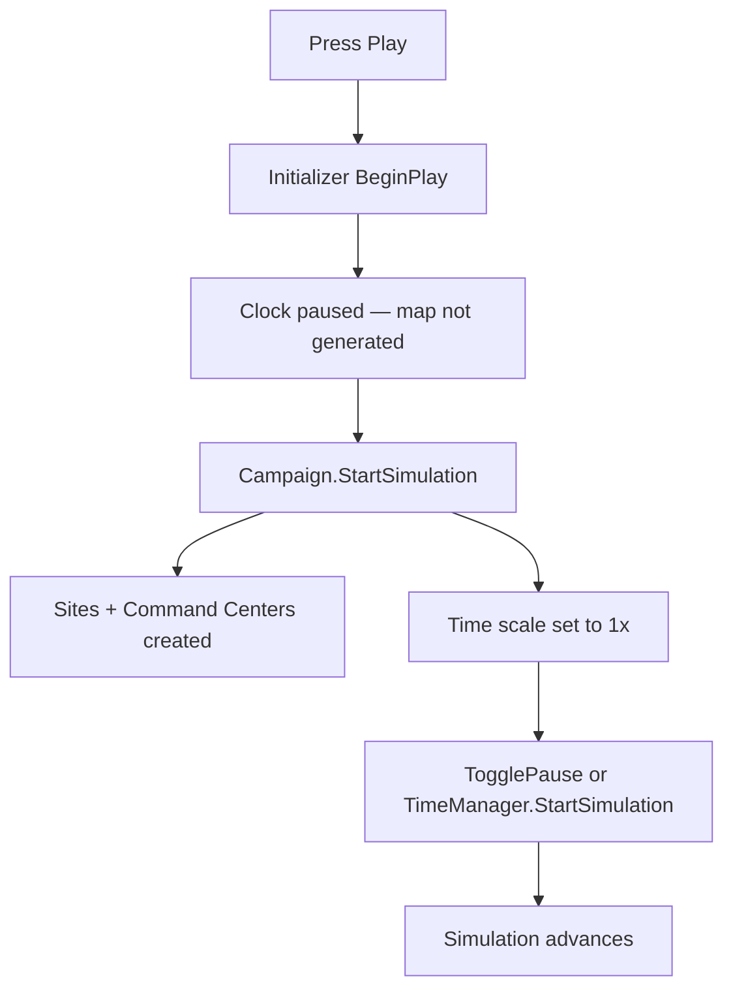

# Getting started

## Prerequisites

- Host Unreal project with this plugin enabled
- **CommonUI** plugin enabled (required)
- Recommended test content: `Content/StratTestGameMode`, `Content/UI/WBP_StrategicHUD`

## Level setup checklist

```
[ ] Place AStrategyGameInitializer in the level
[ ] Assign all 6 database assets on the initializer
[ ] Tune map and AI settings (see Tuning guide)
[ ] Set starting resources for Human and Enemy
[ ] (Optional) Place AStrategyTestActor — auto-spawns HUD on play
[ ] (Optional) Set GameMode HUD to AStrategyDebugHUD for debug map overlay
```

## Wire data assets

On **AStrategyGameInitializer**, assign:

| Property | Typical asset |
|----------|---------------|
| Item Database Asset | `Content/Data/DA_ItemDatabase` |
| Facility Database Asset | `Content/Data/DA_FacilityDatabase` |
| Soldier Class Database Asset | `Content/Data/DA_SoldierDatabase` |
| Research Database Asset | `Content/Data/DA_ResearchDatabase` |
| Vehicle Database Asset | `Content/Data/DA_VehicleDatabase` |
| Vehicle Item Database Asset | `Content/Data/DA_Vehicle_Items` |

Individual definitions live under `Content/Data/DA/` (Fac, Veh, Sol, Item, Res, Tech).

See **[Data assets](data-assets.md)** for how to author facilities, research chains, items, soldiers, and vehicles.

## First run



1. **Play in editor.** Look for: *"Simulation INITIALIZED — Press Start to generate map and begin"*.
2. **Start the campaign.** Call `UStrategyCampaignSubsystem::StartSimulation()` from your HUD.
3. **Unpause time.** `StartSimulation` does not clear the paused flag. Also call `UTimeManagerSubsystem::TogglePause()` or `StartSimulation()` on the time manager.
4. **Control speed** via `WBP_TimeControl` if wired.

## Test harness

**AStrategyTestActor** can auto-spawn:

- `WBP_StrategicHUD` — main HUD
- Salvage map overlay (z-order 10)
- Radar contact overlay (z-order 11)

Assign widget classes on the test actor in the level. Radar overlay defaults to **spectate mode** (no click-to-intercept while AI is on).

## Next steps

- [Data assets](data-assets.md) — author content and unlock chains
- [Tuning guide](tuning.md) — adjust map, AI, salvage, radar
- [UI & events](ui-and-events.md) — bind delegates in Widget Blueprints
- [Debug tools](debug-tools.md) — map overlay and log filters